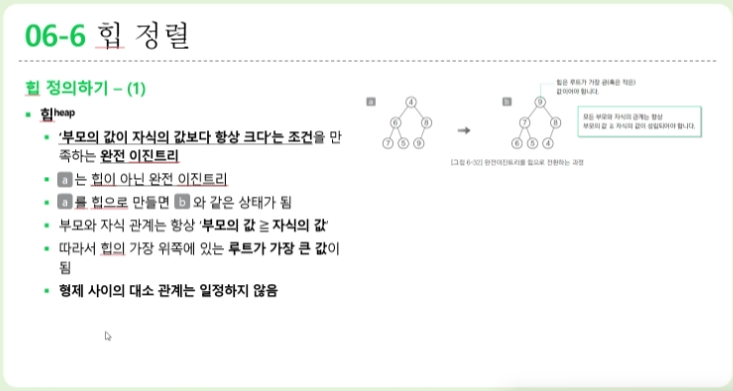
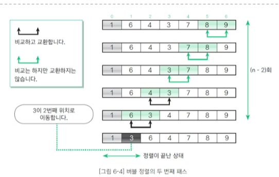

# 202330128장문선

##### 10월 30일 강의

## 04-1 스택이란? ##
### 스택 알아보기 - (1)
* 스택(stack)
  - 데이터를 일시적으로 저장하기 위해 사용하는 자료구조
  - 데이터의 입력과 출력 순서는 후입선출(LIFO, Last In Firts Out)
  - 즉, 가장 나중에 넣은 데이터를 가장 먼저 꺼냄
  - 푸시(push): 스택에 데이터를 넣는 작업
  - 팝(pop): 스택에서 데이터를 꺼내는 작업
  - 꼭대기(top): 푸시 팝을 하는 위치
    - 테이블에 겹겹이 쌓은 접시처럼 데이터를 넣는 작업도 꺼내는 작업도 위쪽부터 수행
  - 바닥(bottom): 스택의 가장 밑바닥 부분

### 스택 만들기-(1)
* 스택 구조체 InStack
  - 스택으로 사용할 배열을 가리키는 포인터 stk
    - 인덱스가 0인 요소를 스택의 바닥(bottom)이라 함
    - 배열의 메모리 공간 할당은 initialize 함수로 생성

* 스택의 최대 용량 max
  - 배열 stk의 요소 개수와 같음

* 스택 포인터 ptr
  - 스택에 쌓여 있는 데이터 개수를 나타냄
  - 스택이 비어있으면 ptr의 값은 0이고 가득 차 있으면 max

  * 스택의 구현 예
 - 함수를 호출하고 실행 할 때 프로그램 내부에서는 스택을 사용
 - 가장 먼저 main 함수를 실행하며 main 함수는 z 함수를 호출
 - 호출된 함수 z는 x 함수와 y함수를 순서대로 호출
 - 함수를 호출할 때에는 푸시하고 함수가 실행을 종료하고 호출한 원래의 함수로 돌아갈 때는 종료할 함수를 팝함
 - main -> z -> x의 순서대로 함수를 호출
  * 이때 스택의 상태는 호출한 함수의 역순으로 겹겹이 쌓여 있어 함수 호출이 계층 구조로 이루어져 있음

### 스택 만들기 - (3)
 * 초기화 함수 Initialize
   - 스택의 메모리 공간(배열)을 확보하는 등의 준비 작업을 수행하는 함수
   

### 스택 만들기 - (4)
* 푸시 함수 Push
  - 스택에 데이터를 추가하는 함수
  - 새로 추가할 데이터(x)를 배열의 요소 stk[ptr]에 저장하고 스택 포인터 ptr을 증가

## 04-2 큐란? ##
### 큐 알아보기
* 큐(queue)
  - 데이터를 일시적으로 쌓아 두기 위한 자료구조
  - 가장 먼저 넣은 데이터를 가장 먼저 꺼내는 선입선출 구조
  - 은행 창구에서 차례를 기다리는 대기열, 마트에서 계산을 기다리는 대기열과 동일
  - 인큐(en-queue): 큐에 데이터를 넣는 작업
  - 디큐(de-queue): 데이터를 꺼내는 작업
  - 프런트(front): 데이터를 꺼내는 쪽
  - 리어(rear): 데이터를 넣는 쪽

### 링 버퍼로 큐 만들기 - (1) 
* 링 버퍼(ring buffer)
  - 배열의 처음이 끝과 연결되었다고 보는 자료구조
  - 프런트(front): 논리적인 맨 처음 요소의 인덱스
  - 리어(rear): 논리적인 맨 끝 요소의 하나 뒤의 인덱스(다음 요소를 인큐할 위치를 미리 지정)
  - 변수 프런트와 리어의 값은 인큐와 디큐를 수행함에 따라 변화하는데 이 때문에 배열 요소를 앞쪽으로 옮기지 않는 큐를 규현할 수 있음
  - 처리의 복잡도는 O(1)
  
#### Stack 후입선출 LIFO, Last In Firts Out
#### Queue 선입선출 FIFO, First In First Out
#### 원형 큐(링 버퍼 큐) 선입선출/rear,front 변수를 수정

## 06-1 정렬
### 정렬 정의하기
 * 정렬
   - 이름,학번,키 등 핵심 항목(key)의 대소 관계에 따라 데이터 집합을 일정한 순서로 줄지어 늘어서도록 바꾸는 작업
   - 키값이 작은 데이터를 앞쪽에 놓으면 오름차순(ascending order)정렬, 그 반대로 놓으면 내림차순(descending order)정렬이라고 부름
 * 정렬 알고리즘의 안정성
   - 안정된 정렬이란 같은 값의 키를 가진 요소의 순서가 정렬 전후에도 유지되는 것
 * 정렬 알고리즘의 핵심 요소
   - 교환,선택,삽입

### 버블 정렬 알아보기 - (1)
* 패스
  - 이웃한 요소를 비교하고 교환하는 작업을 첫 번째 요소까지 계속하면 그림 6-3과 같은 상태가 됨
  - 요소의 개수가 n개인 배열에서 n-1회 비교, 교환을 하고 나면 가장 작은 요소가 맨 처음으로 이동함
  - 이런 일련의 과정(비교,교환작업)을 패스(pass)라고 함

### 버블 정렬 알아보기 - (2)
* 패스 수행 횟수
  - 두 번째 패스의 비교 횟수는 첫 번째 패스보다 1회 적은 n-2회
  - 왜냐하면 패스를 1회 수행할 때마다 정렬할 요소가 하나씩 줄어들기 때문
  - 패스를 k회 수행하면 앞쪽의 요소 k개가 정렬
  - 모든 정렬이 끝나려면 n-1회의 패스가 수행되어야 함ㅇㅇㅇ
  

