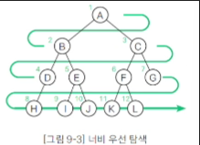

## 09-1 트리란?
### 트리 정의하기 - (1)
* 트리 관련 용어 - (1)
  - 트리를 구성하는 요소는 노드(node)와 가지(edge)
  - 각각의 노드는 가지를 통해 다른 노드와 연결되어 있음
  - 루트(root)
    - 트리의 가장 윗부분에 위치하는 노드

### 트리 정의하기 - (2)
* 트리 관련 용어 - (2)
  - 자식(child)
    - 어떤 노드로부터 가지로 연결된 아래쪽 노드
    - 노드는 자식을 여러 개 가질 수 있음
  - 부모(parent)
    - 어떤 노드에서 가지로 연결된 위쪽 노드
    - 노드는 1개의 부모를 가짐
  - 형제(sibling)
    - 같은 부모를 가지는 노드
  - 조상(ancestor)
    - 어떤 노드에서 가지를 연결된 위쪽 노드 모두
  - 자손(descendant)
    - 어떤 노드에서 가지로 연결된 아래쪽 노드 모두

### 트리 정의하기 - (3)
* 트리 관련 용어 - (3)
  - 레벨(level)
    - 루트로부터 얼마나 떨어져 있는지에 대한 값
    - 루트의 레벨은 0이고 루트로부터 가지가 하나씩 아래로 뻗어나갈 때마다 레벨이 1씩 늘어남
  - 차수(degree)
    - 노드가 갖는 자식의 수
    - 모든 노드의 차수가 n이하인 트리를 n진 트리라고 함
  - 높이(height)
    - 루트로부터 가장 멀리 떨어진 리프까지의 거리(리프 레벨의 최댓값)

### 트리 정의하기 - (4)
* 트리 관련 용어 - (4)
  - 서브 트리(subtree)
    - 트리 안에서 다시 어떤 노드를 루트로 정하고 그 자손으로 이루어진 트리
  - 널 트리(null tree)
    - 노드,가지가 없는 트리

### 순서 트리와 무순서 트리 정의하기
* 순서 트리와 무순서 트리
  - 형제 노드의 순서가 있는지 없는지에 따라 트리를 두 종류로 분류
  - 형제 노드의 순서를 따지면 순서 트리(ordered tree), 따지지 않으면 무순서 트리(unordered tree)라고 함

### 순서 트리의 탐색 방법 알아보기 - (1)
* 너비 우선 탐색(breadth-first Search)
  - 낮은 레벨에서 시작해 왼쪽에서 오른쪽 방향으로 검색하고 한 레벨에서의 검색이 끝나면 다음 레벨로 내려감
  - 검색 순서 : A -> B -> C -> D -> E -> F -> G -> H -> I -> J -> K -> L

## 09-2 이진 트리와 이진검색트리
### 이진트리 정의하기
* 이진트리(binary tree)
  - 노드가 왼쪽 자식과 오른쪽 자식을 갖는 트리
  - 노드의 자식은 2명 이하만 유지해야 함
  - 왼쪽 자식과 오른쪽 자식을 구분함
  - 왼쪽 자식을 다시 루트로 하는 서브 트리를 왼쪽 서브 트리, 오른쪽 자식을 다시 루트로 하는 서브 트리를 오른쪽 서브 트리 라고함

### 완전이진트리 정의하기
* 완전이진트리(complete binary tree)
  - 루트부터 노드가 채워져 있으면서 같은 레벨에서는 왼쪽에서 오른쪽으로 노드가 채워져 있는 이진트리
    - 1.마지막 레벨을 제외한 레벨은 노드를 가득 채움
    - 2.마지막 레벨은 왼쪽부터 오른쪽 방향으로 노드를 채우되 반드시 끝까지 채울 필요는 없음
  - 높이가 k인 완전이진트리가 가질 수 있는 노드의 최댓값은 2^(k+1) - 1개
  - 따라서 n개의 노드를 저장할 수 있는 완전이진트리의 높이는 log n
  - 완전이진트리에서 너비 우선 탐색을 하며 각 노드에 0,1,2,... 값을 주면 배열에 저장하는 인덱스와 1ㄷ1로 대응

### 보충 설명
* 트리의 레벨(level)은 루트에서부터 노드까지 거친 층의 수를 나타내며, 루트는 보통 0레벨 또는 1레벨로 본다.
* 높이(height)는 트리의 최대 레벨과 같으며, 루트에서 가장 먼 리프 노드까지의 경로에 있는 레벨 수(혹은 간선의 최대 개수)를 의미한다.
* 높이가 h일 때 최대 노드의 수 n은 : n = 2^h - 1 (단, 높이를 1에서부터 시작)
* n개의 노드를 가질 때, 완전이진트리의 최대 높이 h는 : h = log₂n + 1(단, 높이를 1에서부터 시작)

### 이진검색트리 살펴보기
* 이진검색트리(binary search tree)
  - 이진트리가 다음의 조건을 만족
    - 1.어떤 노드 N을 기준으로 왼쪽 서브 트리 노드의 모든 키값은 노드 N의 키값보다 작아야 함
    - 2.오른쪽 서브 트리 노드의 키값은 노드 N의 키값보다 커야 함
    - 3.같은 키값을 갖는 노드는 없음
  - 이진검색트리의 특징
    - 구조가 단순함
    - 중위 순화를 하면 키값의 오름차순으로 노드를 얻을 수 있음
    - 이진검색과 비슷한 방식으로 빠르게 검색할 수 있음
    - 노드를 삽입하기 쉬움

## 10-1 해시법
### 충돌 살펴보기 - (1)
* 충돌(collision)
  - 저장할 버킷이 중복되는 현상

* 충돌에 대한 대처
  - 1.체인법:같은 해시값을 갖는 요소를 연결 리스트로 관리
  - 2.오픈 주소법:빈 버킷을 찾을 때까지 해시를 반복

### 체인법 살펴보기 - (1)
* 체인법(chaining)
  - 해시값을 갖는 데이터를 chain모양으로 연결리스트에서 연결하는 방법으로, 오픈 해시법(open hashing)이라고도 함

* 같은 해시값을 갖는 데이터 저장하기
  - 배열의 각 버킷(해시 테이블)에 저장하는 값은 그 인덱스를 해시값으로 하는 연결 리스트의 첫 번째 노드에 대한 포인터

### 오픈 주소법 이해하기 - (1)
* 오픈 주소법(open addressing)
  - 충돌이 발생했을 때 재해시(rehashing)을 수행하여 비어 있는 버킷을 찾아내는 방법으로, 닫힌 해시법(closed hashing)이라고도 함
  - 빈 버킷을 만날 때까지 재해시를 여러 번 반복하므로 연결 탐사법(linear probing)이라고도 함