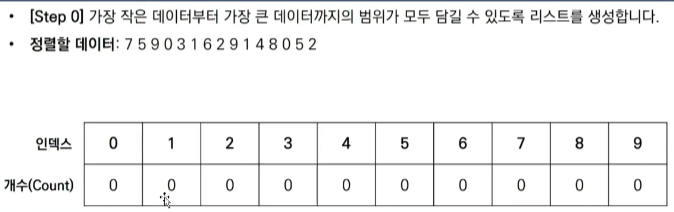
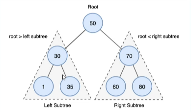
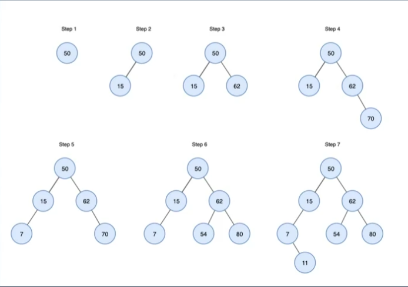
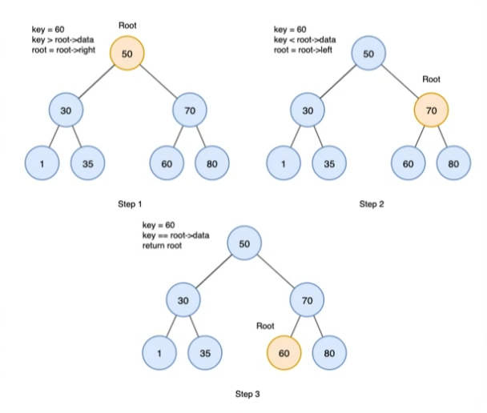

## 자료구조 Review

### 스택(stack)
  - 후입선출(LIFO, Last In First Out) : 가장 나중에 넣은 데이터를 가장 먼저 꺼냄
  - 푸시(push): 스택에 데이터를 넣는 작업
  - 팝(pop): 스택에서 데이터를 꺼내는 작업
  - 꼭대기(top): 푸시, 팝을 하는 위치
  - 바닥(bottom): 스택의 가장 밑부분

### 기본 함수1
- Initialize() : 초기화 함수
- Push() : 푸시 함수. 꼭대기 데이터 넣기
- Pop() : 팝 함수. 꼭대기 데이터 꺼내기
- Peek() : 피크 함수. top의 data 읽기

### 기본 함수2
  - Clear() : 스택의 모든 데이터를 삭제하는 함수
  - Capacity() : 용량을 확인하는 함수. 데이터를 넣을 수 있는 최대 공간.
  - Size() : 데이터의 개수를 확인하는 함수
  - IsEmpty() : 스택이 비어 있는지 검사하는 함수. 비어 있으면 1, 그렇지 않으면 0을 반환
  - IsFull() : 스택이 가득 찼는지 검사하는 함수. 가득 찼으면 1, 그렇지 않으면 0을 반환
  - Search() : 임의의 값을 검색하는 함수
  - Print() : 모든 데이터를 출력하는 함수. 스택의 모든 데이터를 바닥부터 순서대로 출력
  - Terminate() : 종료 함수. Initialize 함수로 확보한 스택을 해제

### 큐(Queue)
  - 선입선출(FIFO, First In First Out): 먼저 넣은 데이터를 가장 먼저 꺼냄
  - 인큐(en-queue): 큐에 데이터를 넣는 작업
  - 디큐(de-queue): 데이터를 꺼내는 작업
  - 프런트(front) : 데이터를 꺼내는 쪽
  - 리어(rear): 데이터를 넣는 쪽
  - 리어로 부터 들어간 데이터를 프런트부터 채워 나감
  - 24 인큐 : 리어에서 데이터 넣음.
  - 19인큐 : 프런트부터 데이터를 꺼냄. 나머지 데이터 프런트로 하나씩 이동
  - 데이터 입출입이 빈번한 경우 원형 큐로 구현하는 것이 효율적

### 기본함수
- Initialize() : 초기화 함수
- Enque(): 인큐 함수. 프런트에서 데이터넣기
- Deque(): 디큐 함수. 리어에서 데이터 꺼내기
- Peek(): 피크 함수. 프런트에서 데이터 읽기
- Clear(): 큐의 모든 데이터를 삭제하는 함수
- Capacity(): 용량을 확인하는 함수. 데이터를 넣을 수 있는 최대 공간
- Size(): 데이터의 개수를 확인하는 함수
- IsEmpty(): 큐가 비어 있는지 검사하는 함수. 비어 있으면 1, 아니면 0
- IsFull(): 큐가 가득 찼는지 검사하는 함수. 가득 찼으면 1, 아니면 0
- Search(): 임의의 값을 검색하는 함수

### 선형 검색(Linear search)
  - 선형 검색 또는 순차 검색(sequential search)이라고 함
  - 원하는 키 값을 갖는 데이터를 만날 때까지 맨 앞부터 순서대로 데이터를 검색
  - 시간 복잡도는 0₍ₙ₎

### 이진 검색(binary search)
  - 오름차순 또는 내림차순으로 정렬된 데이터에서 검색
  - 배열의 '중간 값'을 선택하고 찾고자 하는 값과 비교
  - 만약 중간 값이 찾고자 하는 값보다 크면 '배열 왼쪽 부분'에서 탐색을 진행하고, 작으면 '배열 오른쪽 부분'에서 탐색을 진행
  - 이 과정에서 찾고자 하는 값이 나올 때까지 반복

### 정렬(sorting)
  - 이름,학번,키 등 핵심 항목(key)의 대소 관계에 따라 데이터 집합을 일정한 순서로 줄지어 늘어서도록 바꾸는 작업
  - 오름차순 정렬(ascending order): 키 값이 작은 데이터부터 큰 순서로 정렬
  - 내림차순 정렬(descending order): 키 값이 큰 데이터부터 작은 순서로 정렬

### 버블 정렬(bubble sort)
  - 인접한 두 데이터를 비교하여 기준에 만족하면 데이터를 서로 교환해서 완성될 때까지 반복하는 정렬 방법
  - 오름차순 정렬의 두 데이터를 비교하여 앞쪽 값이 더 크면 데이터를 교환
  - 내림차순 정렬의 두 데이터를 비교하여 앞쪽 값이 더 작으면 데이터를 교환
  - 시간 복잡도는 0₍ₙ^₂₎

### 퀵 정렬(quick sort)
  - 리스트 가운데서 하나의 원소를 고른다. 이렇게 고른 원소를 피벗(pivot)이라고 함
  - 피벗 앞에는 피벗보다 값이 작은 모든 원소들이 오고, 피벗 뒤에는 피벗보다 값이 큰 모든 원소들이 오도록 피벗을 기준으로 리스트를 둘로 나눔
  - 이렇게 하는 배열이 두 부분으로 나뉘어 짐
  - 이 두개의 배열에서 각각 새로운 피벗을 만들어서 두개의 배열로 다시 나눔
  - 더 이상 배열을 쪼갤 수 없을 때까지 계속 진행. 재귀(Recursion)적으로 이 과정을 반복 한다는 의미
  - 이 과정은 분할 정복의 원리를 이용한 것이다.

  - 피벗을 중심으로 문제를 분할하고, 피벗을 기준으로 해서 작은 값과 큰 값을 나열하는 정복 과정을 거친 뒤, 모든 결과를 결합해서 큰 전체 문제를 해결한다
  - 시간 복잡도는 0₍ₙ log ₙ₎

### 힙 정렬(Heap sort)
  - 최댓값, 최솟값을 쉽게 추출할 수 있는 자료구조
  - 최대 힙 트리(내림차순정렬)나 최소 힙 트리(오름차순 정렬)를 구성해 정렬을 하는 방법

  - n개의 노드로 이루어진 완전 이진 트리를 구성합니다
  - 이때 루트 노드부터 부모 노드, 왼쪽 자식 노드, 오른쪽 자식 노드 순으로 구성
  - 정렬해야 할 n개의 요소들로 최대 힙(내림차순기준)을 만듭니다
  - 다음으로 한 번에 하나씩 요소를 힙에서 꺼내서 배열의 뒤부터 저장하면 됩니다
  - 삭제되는 요소들(최댓값부터 삭제)은 값이 감소되는 순서로 정렬되게 된다.

### 도수 정렬(counting sort)
  - 원소의 대소 관계를 판단하지 않고 빠르게 정렬하는 알고리즘으로, 분포 수 세기(distribution counting)정렬이라고도 합니다
  - 배열 내 요소 값들의 개수를 저장하는 카운트 배열(도수 분포표) f를 생성하고 배열의 모든 원소 값을 0으로 초기화 합니다.


### 선형 리스트(Linear List)
  - 데이터를 일렬로 나열하고 순서대로 저장하는 가장 간단한 형태의 자료구조
  - 논리적 순서와 물리적 순서가 일치하며, 메모리에 연속적으로 저장되는 특징이 있다
  - 배열이 대표적인 선형 리스트의 예입니다.
  - 장점
    - 인덱스(Index)로 접근할 수 있기 때문에 접근 속도가 매우 빠름
    - 연속된 메모리 공간에 존재하기 때문에 관리하기가 편함
  - 단점
    - 배열을 이용해 구현하기 때문에 배열이 갖고 있는 메모리 사용의 비효율성 문제를 그대로 가지고 있다
    - 삽입 & 삭제 연산 후에 연속적인 물리 주소를 유지하기 위해 원소들을 이동시키는 추가 작업과 시간이 소요된다

### 연결 리스트(Linked list)
  - 각 노드가 데이터와 포인터를 가지고 한 줄로 연결되어 있는 방식으로 데이터를 저장하는 자료구조 입니다.
  - 데이터 노드를 저장할 때 하나의 데이터와 그 다음 데이터로 가는 주소(다음 노드의 주소)를 함께 저장하여, 논리적으로 연결하는 방식으로 자료를 저장합니다.
  - 데이터는 논리적으로 연결되어 있으므로 배열과 달리 데이터의 삽입 삭제가 자유롭고, 자연스럽게 전체 크기를 늘리고 줄이는 것 또한 가능합니다.

  - 단순 연결 리스트(singly linked list) : 데이터와 함께 다음 노드의 주소(포인터)를 함께 가지고 있는 구조
  - 이중 연결 리스트(doubly linked list) : 데이터와 함께 이전과 다음 노드의 주소를 모두 함께 가지고 있는 구조
  - 순환 연결 리스트(circular linked list) : 단순 연결 리스트이 마지막 노드가 첫 번째 노드의 주소를 가지고 있는 구조
  - 원형 이중 연결 리스트(circular doubly linked list) : 이중 연결 리스트와 순환 연결 리스트를 합친 구조

### 트리(Tree)
  - 트리를 구성하는 요소는 노드(node)와 가지(edge) 두가지입니다.
  - 각각의 노드는 가지를 통해 다른 노드와 연결되어 있습니다.
  - 루트(root) 노드 : 트리의 가장 윗부분에 위치하는 노드로 트리에 단 한개만 존재
  - 단말(leaf) 노드 : 트리의 아랫부분에 위치하여 자식 노드가 없는 노드
  - 내부(internal) 노드 : 단말 노드가 아닌 노드로 여기에는 루트 노드도 포함

  - 트리의 크기(size) : 루트를 포함한 모든 자손 노드의 개수
  - 트리의 깊이(depth) : 루트에서 어떤 노드에 도달하기 위해 거쳐야 하는 간선의 개수
  - 트리의 레벨(level) : 트리의 특정 깊이를 가지는 노드의 집합
  - 트리의 차수(degree) : 각 노드가 지닌 가지의 수
  - 트리의 차수(degree if tree) : 트리의 최대 차수
  - 트리의 높이(height) : 루트 노드에서 가장 깊숙이 있는 노드의 깊이
  - 서브 트리(subtree) : 트리 안에서 다시 어떤 노드를 루트로 정하고 그 자손으로 이루어진 트리
  - 널 트리(null tree) : 노드, 가지가 없는 트리

### 이진 트리(binary tree)
  - 노드가 왼쪽 자식과 오른쪽 자식을 갖는 트리
  - 노드의 자식은 2명 이하만 유지해야 함
  - 왼쪽 자식과 오른쪽 자식을 구분함
  - 왼쪽 자식을 다시 루트로 하는 서브 트리를 왼쪽 서브 트리(left subtree), 오른쪽자식을 다시 루트로 하는 서브 트리를 오른쪽 서브 트리(right subtree)라고 함

### 완전 이진 트리(complete binary tree)
  - 루트부터 노드가 채워져 있으면서 같은 레벨에서는 왼쪽에서 오른쪽으로 노드가 채워져 있는 이진 트리
    - 1.마지막 레벨을 제외한 레벨은 노드를 가득 채움
    - 2.마지막 레벨은 왼쪽부터 오른쪽 방향으로 노드를 채우되 반드시 끝까지 채울 필요는 없음
  - 높이가 k인 완전이진트리가 가질 수 있는 노드의 최댓값은 2^(k+1) - 1개
  - 따라서 n개의 노드를 저장할 수 있는 완전이진트리의 높이는 log n
  - 완전 이진 트리에서 너비 우선 탐색을 하며, 각 노드에 0,1,2,... 값을 주면 배열에 저장하는 인덱스와 일대일로 대응
  - 트리의 레벨은 루트에서부터 노드까지 거친 층의 수를 나타내며, 루트는 보통 0레벨 또는 1레벨로 본다
  - 높이는 트리의 최대 레벨과 같으며, 루트에서 가장 먼 리프 노드까지의 경로에 있는 레벨 수(혹은 간선의 최대 개수)를 의미한다
  - 높이가 h일때 최대 노드의 수 n은 : n = 2^h - 1(단 높이를 1에서부터 시작)
  - n개의 노드를 가질 때, 완전 이진트리의 최대 높이 h는 : h = log₂n + 1(단, 높이를 1에서부터 시작)

### 이진 검색 트리(binary search tree)
  - 이진 트리가 다음 3가지 조건을 만족하면 이진 검색 트리가 된다
  - 1.어떤 노드 N을 기준으로 왼쪽 서브 트리 노드의 모든 키 값은 노드 N의 키값보다 작아야함
  - 2.오른쪽 서브 트리 노드의 키 값은 노드 N의 키 값보다 커야 함
  - 3.같은 키 값을 갖는 노드가 없어야 함


 - 이진 검색 트리의 특징은 다음과 같다
   - 1.구조가 단순함
   - 2.중위 순회를 하면 키 값의 오름차순으로 노드를 얻을 수 있음
   - 3.이진검색과 비슷한 방식으로 빠르게 검색할 수 있음
   - 4.노드를 삽입하기 쉬움
   - 다음 그림은 이진 검색 트리의 생성 예시 이다.
```
let foo = [ 50, 15, 62, 80, 7, 54, 11 ]
```


 - 검색 과정은 다음과 같다
   - 1.루트에서 시작
   - 2.검색 값을 루트와 비교. 루트보다 작으면 왼쪽에 대해 재귀, 크면 오른쪽으로 재귀
   - 3.일치하는 값을 찾을 때까지 절차 반복
   - 4.검색 값이 없으면 null 반환
   - 다음 그림은 60을 찾는 과정 이다.


 - 삭제 과정은 다음과 같은 3가지 경우가 있다
   - 1.삭제할 노드가 리프 노드인 경우는 검색후 바로 삭제하면 됨
   - 2.삭제할 노드에 자식이 하나만 있는 경우는 노드를 삭제하고 자식 노드를 삭제된 노드의 부모에 직접 연결
   - 3.삭제할 노드에 자식이 둘 있는 경우는 successor 노드를 찾는 과정이 추가됨
     - successor 노드란 삭제할 노드의 값보다 크면서 가장 작은 키를 가진 노드
     - 즉 오른쪽 서브 트리 중에서 가장 작은 값을 의미

### 해시 법(hashing)
  - 해시법은 데이터를 저장할 인덱스를 해시 함수로 계산하여, 데이터의 검색, 추가, 삭제를 효율적으로 수행하는 자료구조
  - 해시 함수를 이용해 키(key)값을 고정된 길이의 해시 값으로 변환하고, 이 해시 값을 배열의 인덱스로 사용하여 데이터를 저장하는 방식
  - 이 과정에서 여러 키가 동일한 해시 값으로 변환되는 해시 충돌이 발생할 수 있으며, 이를 해결하기 위해 체인법이나 개방 주소 법 같은 방법들이 사용된다.
### 해시법의 핵심 요소
  - 해시 함수 : 임의의 길이를 가진 데이터를 고정된 길이의 값으로 변환하는 함수
  - 해시 테이블 : 해시 함수를 통해 얻은 해시 값을 인덱스로 사용하여 데이터를 저장하는 배열 기반의 자료구조
  - 해시 충돌 : 서로 다른 키 값이 해시 함수를 통해 같은 해시 값으로 변환되어 같은 인덱스에 저장 하는 현상

### 해시 값을 사용하는데 왜 충돌이 발생하나?
  - Git 등에서 쓰는 해시는 사실상 충돌이 없다고 간주할 만큼 강력한 암호학적 해시이다
  - 이에 반해 자료구조 해시는 빠른 접근을 위해 설계된 약한 해시이다
  - 따라서 Git 같은 시스템에서는 사실상 충돌이 거의 발생하지 않지만, 자료구조에서는 충돌이 자주 발생한다

1. Git의 해시(SHA-1/SHA-256)는 암호학적 해시(Cryptographic Hash)
  - 입력이 조금만 달라도 완전히 다른 해시가 나옴 (Avalanche effect)
  - 임의로 충돌을 만들기는 거의 불가능
  - 충돌 확률 = 2^160분의 1 (SHA-1기준) -> 약 1e48분의 1 (10^-48) -> 사실상 우주에서 원자 1개 찾기보다 어려움
  - 즉, Git에서의 해시 충돌은 이론적으로는 가능하지만 현실적으론 불가능한 사건으로 취급하기 때문에 별도의 충돌 처리법을 쓰지 않습니다.

2. 자료구조의 해시는 "빠르고 단순하기 위해 만든 해시 함수"
  - 자료구조(해시 테이블)에서 사용하는 해시는 목적이 전혀 다름
  - 요구 조건
    - 계산이 매우 빨라야함
    - 숫자나 문자열을 적당히 분산시키기만 하면 충분
    - 충돌이 나도 체인법/개방 주소법으로 해결 가능

3. 체인 법(Chaining, Separate chaining)
  - 해시 테이블의 각 버킷이 리스트(연결 리스트등)를 가지고 있어서, 충돌이 발생하면 그 버킷의 리스트에 노드를 추가하는 방식
  - 장점
    - 구현이 매우 간단
    - 테이블이 거의 가득 차도 삽입 가능(list만 늘리면 됨)
    - 삭제가 쉬움(리스트에서 node만 제거)
  - 단점
    - 충돌이 많아지면 리스트 길이가 길어져 검색시간이 늘어남
    - 리스트를 위한 추가 메모리 사용
    - 포인터 사용으로 메모리 locality가 떨어져 느려질 수 있음