# 202330128 장문선


# 11월 6일 강의


## 06-6 퀵 정렬
### qsort 함수를 사용해 정렬하기 - (1)
* qsort 함수
  - qsort 함수는 bsearch 함수와 마찬가지로 int형이나 double형 등의 배열뿐만 아니라 구조체형 배열등 모든 자료형의 배열에 적용할 수 있음
  - qsort 함수에 전달하는 4개 인수는 앞에서부터 차례대로 배열의 첫 번째 요소에 대한 포인터, 요소의 개수, 요소의 크기, 비교 함수에 대한 포인터
  - 비교 함수는 아래의 값을 반환하며 직접 작성해야 함
    - 첫 번째 인수가 가리키는 값이 더 작은 경우 음숫값(-1)을 반환
    - 첫 번째 인수가 가리키는 값과 두 번째 인수가 가리키는 값이 같은 경우 0을 반환
    - 첫 번째 인수가 가리키는 값이 더 큰 경우 양숫값(1)을 반환

## 06-6 병합 정렬
### 정렬을 마친 배열 병합하기 - (1)
* 병합(merge)
  - ＃ a,b모두 정렬이 끝난 배열이 조건!
  - '각 배열에서 선택한 요소의 값을 비교하여 작은 값의 요소를 꺼내 새로운 배열에 넣는 작업'을 반복하여 정렬을 마치는 배열을 만듦
  - merge 함수는 요소의 개수가 na개인 배열 a와 요소의 개수가 nb개인 배열 b를 병합하여 배열 c에 저장
  - 이 함수에서는 세 개의 배열 a,b,c를 동시에 스캔
    - 이때 각 배열이 선택한 요소의 인덱스는 pa,pb,pc
    - 이 인덱스를 저장한 변수를 커서라고 함
  - 처음에는 첫 요소를 선택하므로 커서를 모두 0으로 초기화

## 06-6 병합 정렬
### 병합 정렬하기 - (1)
* 병합 정렬(merge sort)
  - 정렬을 마친 배열의 병합을 응용하여 분할 정복법에 따라 정렬하는 알고리즘
  - 먼저 배열을 앞부분과 뒷부분으로 나눔
  - 나눈 두 배열을 각각 정렬하고 병합하면 배열 모두를 정렬할 수 있음

* 병합 정렬 알고리즘
  - 배열의 요소 개수가 2개 이상인 경우
    - 1.배열의 앞부분을 병합 정렬로 정렬
    - 2.배열의 뒷부분을 병합 정렬로 정렬
    - 3.배열의 앞부분과 뒷부분을 병합

## 06-6 힙 정렬
### 힙 정의하기 - (1)
* 힙(heap)
  - '부모의 값이 자식의 값보다 항상 크다'는 조건을 만족하는 완전 이진트리
  - a는 힙이 아닌 완전 이진트리
  - a를 힙으로 만들면 b와 같은 상태가 됨
  - 부모와 자식 관계는 항상 '부모의 값>= 자식의 값'
  - 따라서 힙의 가장 위쪽에 있는 루트가 가장 큰 값이 됨
  - 형제 사이의 대소 관계는 일정하지 않음
  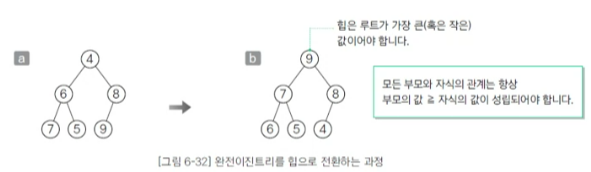

## 06-6 힙 정렬
### 힙 정의하기 - (2)
* 힙의 요소를 배열에 저장
  - 가장 위쪽에 있는 루트(10)을 a[0]에 넣음
  - 한 단계 아래 요소를 왼쪽에서 오른쪽으로 따라 감
  - 인덱스의 값을 1씩 늘리면서 배열의 각 요소에 힙의 요소를 대입
  - 이 과정을 거쳐 힙의 요소를 배열에 저장하면 부모와 자식의 인덱스 사이에 다음과 같은 관계가 성립
    - 1.부모는 a[(i-1)/2]
    - 2.왼쪽 자식은 a[i*2 + 1]
    - 3.오른쪽 자식은 a[i * 2 + 2]
  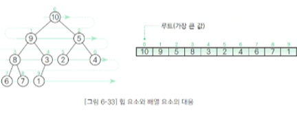

## 06-6 힙 정렬
### 힙 정렬 알아보기 - (1)
* 힙 정렬
  - '가장 큰 값이 루트에 위치'하는 특징을 이용하는 정렬 알고리즘
  - 다음과 같은 작업을 반복해 그 과정에서 꺼낸 갑승ㄹ 늘어놓으면 정렬이 끝남
    - 힙에서 가장 큰 값인 루트를 꺼냄
    - 루트 이외의 부분을 힙으로 전환
  - 힙 정렬은 선택 정렬을 응용한 알고리즘
  - 힙에서 가장 큰 값인 루트를 꺼내고 남은 요소에서 다시 가장 큰 값을 구해야 함

## 힙이란?
  - 우선순위 큐를 위해 고안된 완전이진트리 형태의 자료구조
  - 여러 값 중, 최대값과 최소값을 빠르게 찾아내도록 만들어진 자료구조
  - 반정렬 상태를 유지
  - ex.부모 노드이 키 값이 자식 노드이 키 값보다 항상 큼 / 작음
  - 이진탐색트리(BST)와 달리 중복된 값이 허용된다.

## 트리의 종류와 힙 - (1)
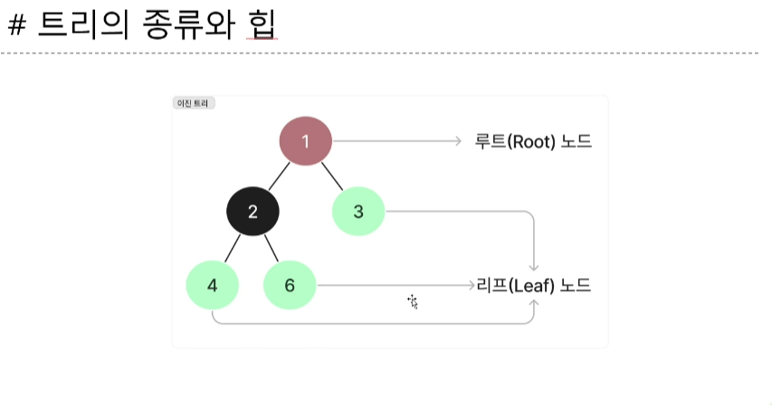

## 트리의 종류와 힙 - (2)


## 트리의 종류와 힙 - (3)
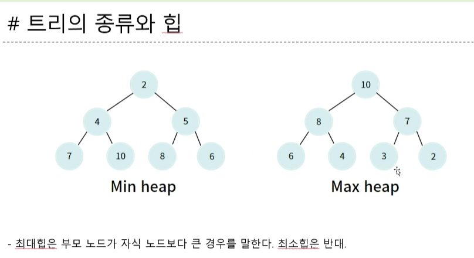


## 06-6 도수 정렬
### 도수 정렬하기 - (1)
  - 도수 정렬
    - 지금까지의 정렬 알고리즘은 두 요소의 키값을 비교해야 했음
    - 도수 정렬은 요소를 비교할 필요가 없다는 특징이 있음
  - 도수 정렬 알고리즘
    - 도수분포표 만들기
    - 누적도수분포표 만들기
    - 목적 배열 만들기
    - 배열 복사하기


## 테크페어(Tech-Fair)
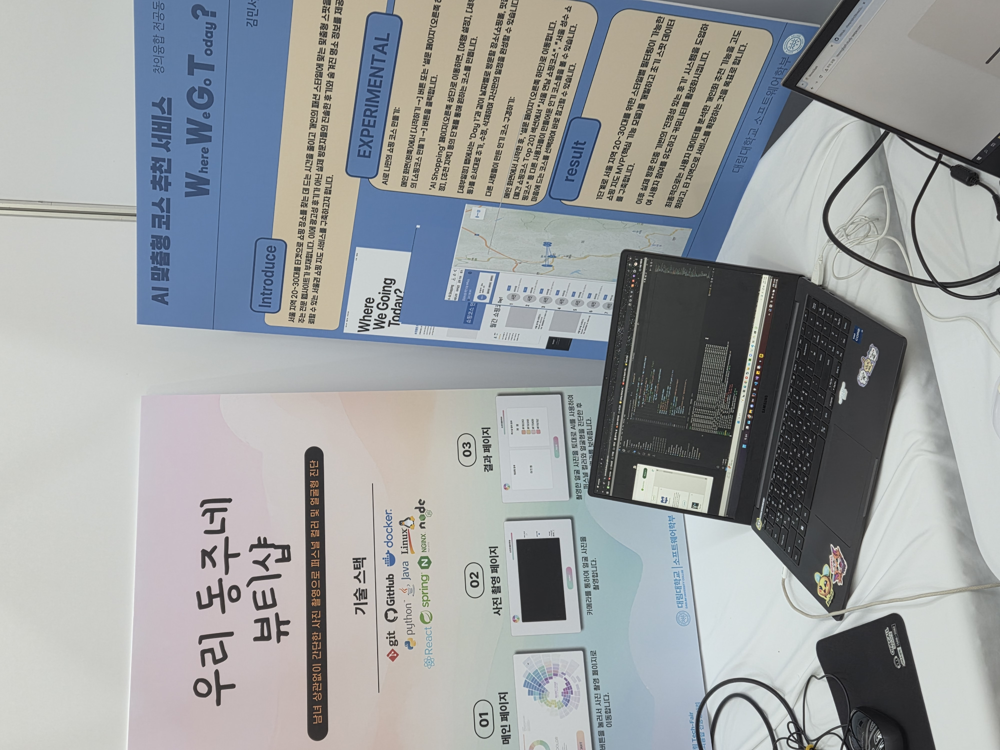
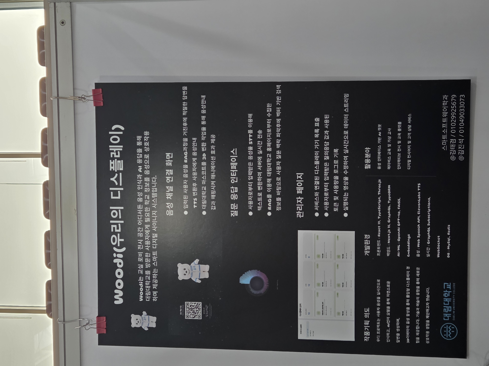
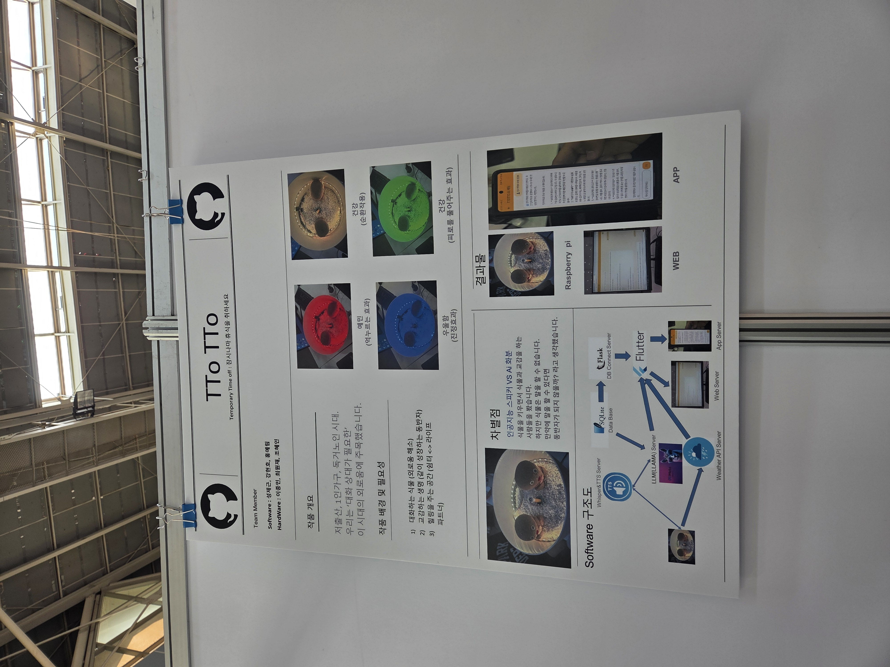


# 10월 31일 강의


## 06-3 단순 선택 정렬
### 단순 선택 정렬 알아보기 - (1)
 * 단순 선택 정렬(straight selection sort)
   - 아직 정렬하지 않은 부분에서 값이 가장 작은 요소를 선택하고 아직 정렬하지 않은 부분의 첫 번째 요소와 교환
   - 키값이 작은 데이터를 앞쪽에 놓으면 오름차순(ascending order)정렬, 그 반대로 놓으면 내림차순(descending order)정렬이라고 부름
 * 교환 과정
   - 1.아직 정렬하지 않은 부분에서 가장 작은 키의 값(a[min])을 선택
   - 2.a[min]과 아직 정렬하지 않은 부분의 첫 번째 요소를 교환

### 단순 선택 정렬 알아보기 - (2)

* 실습 6-4
  - 단순 선택 정렬을 수행하는 함수
  - 단순 선택 정렬 알고리즘의 요솟값을 비교하는 횟수는 (n²-n) / 2회
  - 이 정렬 알고리즘은 서로 떨어져 있는 요소를 교환하는 것이기 때문에 안정적이지 않음
```
<!-- 단순 선택 정렬 -->
void selection(int a [], int n)
{
    for(int i = 0; i < n - 1; i++){
        int min = i;
        for(int j = i + 1; j < n; j++)
            if(a[j] < a[min])
            min = j;
            swap(int, a[i], a[min]);
    }
}
```

## 06-4 단순 삽입 정렬
### 단순 삽입 정렬 알아보기 - (1)
 * 단순 삽입 정렬(straight insertion sort)
   - 선택한 요소를 그보다 더 앞쪽의 알맞은 위치에 '삽입하는' 작업을 반복하여 정렬하는 알고리즘
   - 아직 정렬되지 않은 부분의 첫 번째 요소를 정렬된 부분의 알맞은 위치에 삽입
   - 아래의 두 조건 중 하나를 만족할 때까지 j를 1씩 감소하면서 대입하는 작업을 반복
     - 1.정렬된 열의 왼쪽 끝에 도달
     - 2.tmp보다 작거나 같은 key를 갖는 항목 a[j-1]을 발견
   - 드모르간 법칙 적용을 통해 아르이 두 조건이 모두 성립할 때까지 반복
     - 1.j가 0보다 큼
     - 2.a[j-1]값이 tmp보다 큼  
 

## 06-5 셸 정렬
### 단순 삽입 정렬의 특징 이해하기
 * 단순 삽입 정렬의 특징
   - 정렬을 마쳤거나 정렬을 마친 상태에 가까우면 정렬 속도가 매우 빨라짐(장점)
   - 삽입할 위치가 멀리 떨어져 있으면 이동(대입)해야하는 횟수가 많아짐(단점)

## 06-5 셸 정렬
### 셸 정렬 살펴보기 - (1)
 * 셸 정렬(shell sort)
   - 단순 삽입 정렬의 장점은 살리고 단점은 보안한 정렬 알고리즘
   - 정렬할 배열의 요소를 그룹으로 나눠 각 그룹별로 단순 삽입 정렬을 수행
   - 그 그룹을 합치면서 정렬을 반복하여 요소의 이동 횟수를 줄이는 방법
* 4-정렬
  - 4칸만큼 떨어진 요소를 모아 그룹을 4개로 나누어 정렬하는 방법
  - 아직 정렬을 마친 상태는 아니지만 정렬을 마친 상태에 가까워짐

## 06-5 셸 정렬
### 셸 정렬 살펴보기 - (2)
* 2-정렬
  - 2칸만큼 떨어진 요소를 모아 두그룹({7,3,8,4},{1,2,6,5})으로 나누어 2-정렬을 함
  - 정렬을 마치고 나면 각각의 그룹은 {3,4,7,8}, {1,2,5,6}으로 정렬됨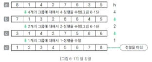
* h-정렬
  - 셀 정렬 과정에서 수행하는 각각의 정렬
    - 1.2개 요소에 대해 4-정렬(4개의 그룹)
    - 2.4개 요소에 대해 2-정렬(2개의 그룹)
    - 3.8개 요소에 대해 1-정렬(1개의 그룹)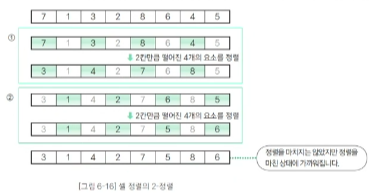


## 06-6 퀵 정렬
### 퀵 정렬 살펴보기
* 퀵 정렬(quick sort)
  - 일반적으로 사용되고 있는 아주 빠른 정렬 알고리즘
  - 그림 6-19는 이 알고리즘으로 학생 수가 8명인 그룹을 키 순서대로 정렬한 모습을 나타낸 것
  - 먼저 어느 한 사람의 키를 선택
  - 키가 168cm인 학생 A를 선택할 경우 그 학생을 기준으로 학생 A의 키보다 작은 사람의 그룹과 큰 사람의 그룹으로 나눔
  - 이때 이 학생 A의 키를(그룹을 나누는 기준) 피벗(pivot)이라고 함
  - 퀵 정렬은 각 그룹에 대해 피벗 설정과 그룹 나눔을 반복하며 모든 그룹이 1명이 되면 정렬을 마침
  

  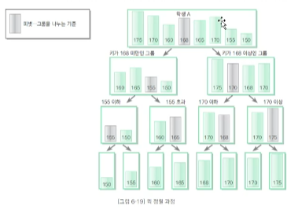

  ### 배열을 두 그룹으로 나누기 - (3)
  * 실습 6-8 - (1)
    - partition 함수의 13~21행에서 배열 a의 그룹을 나눔
    - 피벗은 '배열의 중앙에 위치한 요소'인 a[n/2]로 함
    - 피벗의 선택은 분할 및 정렬에 영향을 미침

```
//배열을 나누는 프로그램
#include <stdio.h>
#include <stdlib.h>

#define swap(type, x, y) do { type t= x; x = y; y = t;} while(0)

<!-- 배열을 나누는 함수 -->
void partition(int a[], int n)
{
    int pl = 0;             //왼쪽커서
    int pr = n - 1;         //오른쪽커서
    int x = a[n / 2];       //피벗은 가운데 요소를 선택
    do{
      while(a[al] < x) pl++;
      while(a[al] > x) pr--;
      if(pl <= pr){
        swap(int , a[pl], a[pr]);
        pl++;
        pr--;
      }
    } while(pl <= pr);
    printf("피뱃의 값은 %d입니다.\n",x);
    printf("피뱃 이하의 그룹\n");       //피뱃 이하의 그룹
    for(int i = 0; i <= pl - i; i++)  //a[0] ~ a[pl - 1]
      printf("%d ", a[i]);
    putchar('\n');
    if(pl >pr + 1){
      printf("피뱃과 일치하는 그룹\n");  //피뱃과 같은 그룹
      for(int i = pr + 1; i <= pl - 1; i++) //a[pr + 1] ~ a[pl - 1]
        printf("%d ",a[i]);
      putchar('\n');  
    }  
    printf("피뱃과 이상의 그룹\n");  //피뱃 이상의 그룹
      for(int i = pr + 1; i < n; i++) //a[pr + 1] ~ a[n - 1]
        printf("%d ",a[i]);
      putchar('\n'); 
}
```

# 10월 30일 강의


## 04-1 스택이란? 
### 스택 알아보기 - (1)
* 스택(stack)
  - 데이터를 일시적으로 저장하기 위해 사용하는 자료구조
  - 데이터의 입력과 출력 순서는 후입선출(LIFO, Last In Firts Out)
  - 즉, 가장 나중에 넣은 데이터를 가장 먼저 꺼냄
  - 푸시(push): 스택에 데이터를 넣는 작업
  - 팝(pop): 스택에서 데이터를 꺼내는 작업
  - 꼭대기(top): 푸시 팝을 하는 위치
    - 테이블에 겹겹이 쌓은 접시처럼 데이터를 넣는 작업도 꺼내는 작업도 위쪽부터 수행
  - 바닥(bottom): 스택의 가장 밑바닥 부분


### 스택 만들기-(1)
* 스택 구조체 InStack
  - 스택으로 사용할 배열을 가리키는 포인터 stk
    - 인덱스가 0인 요소를 스택의 바닥(bottom)이라 함
    - 배열의 메모리 공간 할당은 initialize 함수로 생성

* 스택의 최대 용량 max
  - 배열 stk의 요소 개수와 같음

* 스택 포인터 ptr
  - 스택에 쌓여 있는 데이터 개수를 나타냄
  - 스택이 비어있으면 ptr의 값은 0이고 가득 차 있으면 max

  * 스택의 구현 예
 - 함수를 호출하고 실행 할 때 프로그램 내부에서는 스택을 사용
 - 가장 먼저 main 함수를 실행하며 main 함수는 z 함수를 호출
 - 호출된 함수 z는 x 함수와 y함수를 순서대로 호출
 - 함수를 호출할 때에는 푸시하고 함수가 실행을 종료하고 호출한 원래의 함수로 돌아갈 때는 종료할 함수를 팝함
 - main -> z -> x의 순서대로 함수를 호출
  * 이때 스택의 상태는 호출한 함수의 역순으로 겹겹이 쌓여 있어 함수 호출이 계층 구조로 이루어져 있음


### 스택 만들기 - (3)
 * 초기화 함수 Initialize
   - 스택의 메모리 공간(배열)을 확보하는 등의 준비 작업을 수행하는 함수
   

### 스택 만들기 - (4)
* 푸시 함수 Push
  - 스택에 데이터를 추가하는 함수
  - 새로 추가할 데이터(x)를 배열의 요소 stk[ptr]에 저장하고 스택 포인터 ptr을 증가


## 04-2 큐란? ##
### 큐 알아보기
* 큐(queue)
  - 데이터를 일시적으로 쌓아 두기 위한 자료구조
  - 가장 먼저 넣은 데이터를 가장 먼저 꺼내는 선입선출 구조
  - 은행 창구에서 차례를 기다리는 대기열, 마트에서 계산을 기다리는 대기열과 동일
  - 인큐(en-queue): 큐에 데이터를 넣는 작업
  - 디큐(de-queue): 데이터를 꺼내는 작업
  - 프런트(front): 데이터를 꺼내는 쪽
  - 리어(rear): 데이터를 넣는 쪽

### 링 버퍼로 큐 만들기 - (1) 
* 링 버퍼(ring buffer)
  - 배열의 처음이 끝과 연결되었다고 보는 자료구조
  - 프런트(front): 논리적인 맨 처음 요소의 인덱스
  - 리어(rear): 논리적인 맨 끝 요소의 하나 뒤의 인덱스(다음 요소를 인큐할 위치를 미리 지정)
  - 변수 프런트와 리어의 값은 인큐와 디큐를 수행함에 따라 변화하는데 이 때문에 배열 요소를 앞쪽으로 옮기지 않는 큐를 규현할 수 있음
  - 처리의 복잡도는 O(1)
  
#### Stack 후입선출 LIFO, Last In Firts Out
#### Queue 선입선출 FIFO, First In First Out
#### 원형 큐(링 버퍼 큐) 선입선출/rear,front 변수를 수정


## 06-1 정렬
### 정렬 정의하기
 * 정렬
   - 이름,학번,키 등 핵심 항목(key)의 대소 관계에 따라 데이터 집합을 일정한 순서로 줄지어 늘어서도록 바꾸는 작업
   - 키값이 작은 데이터를 앞쪽에 놓으면 오름차순(ascending order)정렬, 그 반대로 놓으면 내림차순(descending order)정렬이라고 부름
 * 정렬 알고리즘의 안정성
   - 안정된 정렬이란 같은 값의 키를 가진 요소의 순서가 정렬 전후에도 유지되는 것
 * 정렬 알고리즘의 핵심 요소
   - 교환,선택,삽입

### 버블 정렬 알아보기 - (1)
* 패스
  - 이웃한 요소를 비교하고 교환하는 작업을 첫 번째 요소까지 계속하면 그림 6-3과 같은 상태가 됨
  - 요소의 개수가 n개인 배열에서 n-1회 비교, 교환을 하고 나면 가장 작은 요소가 맨 처음으로 이동함
  - 이런 일련의 과정(비교,교환작업)을 패스(pass)라고 함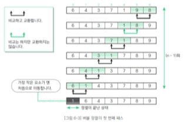

### 버블 정렬 알아보기 - (2)
* 패스 수행 횟수
  - 두 번째 패스의 비교 횟수는 첫 번째 패스보다 1회 적은 n-2회
  - 왜냐하면 패스를 1회 수행할 때마다 정렬할 요소가 하나씩 줄어들기 때문
  - 패스를 k회 수행하면 앞쪽의 요소 k개가 정렬
  - 모든 정렬이 끝나려면 n-1회의 패스가 수행되어야 함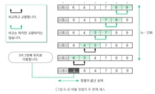


[문자 크기](#h1에-해당) / [리스트](#리스트)

# h1에 해당
## h2에 해당
### h3에 해당
#### h4에 해당
##### h5에 해당
###### h6에 해당

*이탤릭 체*  
**볼드 체**


# 리스트
***
* 언오더드 리스트
- 언
    * 탭
    * 턉
        * 탭
        * 탭
            * 변화없음
1. 오더드 리스트
2. 
3. 

```

# 코드 블럭

```c
#include <stdio.h>
{
    printf("hello,world\n);
    return 0;
}
```
인라인 코드 블럭 예 :`<br>` 다른 예 : `ctrl`+`A`

# 외부링크
[구글로가기] (https://google.com)


# [내부](#)
