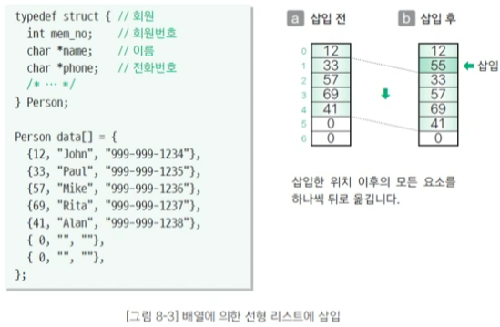
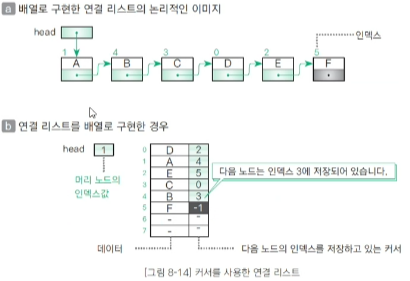
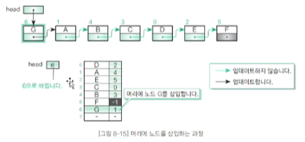
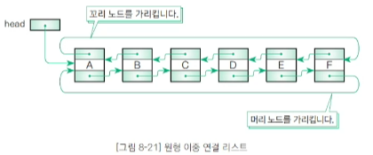

# 202330128 장문선


# 11월 27일 리뷰

## 자료구조 Review

### 스택(stack)
  - 후입선출(LIFO, Last In First Out) : 가장 나중에 넣은 데이터를 가장 먼저 꺼냄
  - 푸시(push): 스택에 데이터를 넣는 작업
  - 팝(pop): 스택에서 데이터를 꺼내는 작업
  - 꼭대기(top): 푸시, 팝을 하는 위치
  - 바닥(bottom): 스택의 가장 밑부분

### 기본 함수1
- Initialize() : 초기화 함수
- Push() : 푸시 함수. 꼭대기 데이터 넣기
- Pop() : 팝 함수. 꼭대기 데이터 꺼내기
- Peek() : 피크 함수. top의 data 읽기

### 기본 함수2
  - Clear() : 스택의 모든 데이터를 삭제하는 함수
  - Capacity() : 용량을 확인하는 함수. 데이터를 넣을 수 있는 최대 공간.
  - Size() : 데이터의 개수를 확인하는 함수
  - IsEmpty() : 스택이 비어 있는지 검사하는 함수. 비어 있으면 1, 그렇지 않으면 0을 반환
  - IsFull() : 스택이 가득 찼는지 검사하는 함수. 가득 찼으면 1, 그렇지 않으면 0을 반환
  - Search() : 임의의 값을 검색하는 함수
  - Print() : 모든 데이터를 출력하는 함수. 스택의 모든 데이터를 바닥부터 순서대로 출력
  - Terminate() : 종료 함수. Initialize 함수로 확보한 스택을 해제

### 큐(Queue)
  - 선입선출(FIFO, First In First Out): 먼저 넣은 데이터를 가장 먼저 꺼냄
  - 인큐(en-queue): 큐에 데이터를 넣는 작업
  - 디큐(de-queue): 데이터를 꺼내는 작업
  - 프런트(front) : 데이터를 꺼내는 쪽
  - 리어(rear): 데이터를 넣는 쪽
  - 리어로 부터 들어간 데이터를 프런트부터 채워 나감
  - 24 인큐 : 리어에서 데이터 넣음.
  - 19인큐 : 프런트부터 데이터를 꺼냄. 나머지 데이터 프런트로 하나씩 이동
  - 데이터 입출입이 빈번한 경우 원형 큐로 구현하는 것이 효율적

### 기본함수
- Initialize() : 초기화 함수
- Enque(): 인큐 함수. 프런트에서 데이터넣기
- Deque(): 디큐 함수. 리어에서 데이터 꺼내기
- Peek(): 피크 함수. 프런트에서 데이터 읽기
- Clear(): 큐의 모든 데이터를 삭제하는 함수
- Capacity(): 용량을 확인하는 함수. 데이터를 넣을 수 있는 최대 공간
- Size(): 데이터의 개수를 확인하는 함수
- IsEmpty(): 큐가 비어 있는지 검사하는 함수. 비어 있으면 1, 아니면 0
- IsFull(): 큐가 가득 찼는지 검사하는 함수. 가득 찼으면 1, 아니면 0
- Search(): 임의의 값을 검색하는 함수

### 선형 검색(Linear search)
  - 선형 검색 또는 순차 검색(sequential search)이라고 함
  - 원하는 키 값을 갖는 데이터를 만날 때까지 맨 앞부터 순서대로 데이터를 검색
  - 시간 복잡도는 0₍ₙ₎

### 이진 검색(binary search)
  - 오름차순 또는 내림차순으로 정렬된 데이터에서 검색
  - 배열의 '중간 값'을 선택하고 찾고자 하는 값과 비교
  - 만약 중간 값이 찾고자 하는 값보다 크면 '배열 왼쪽 부분'에서 탐색을 진행하고, 작으면 '배열 오른쪽 부분'에서 탐색을 진행
  - 이 과정에서 찾고자 하는 값이 나올 때까지 반복

### 정렬(sorting)
  - 이름,학번,키 등 핵심 항목(key)의 대소 관계에 따라 데이터 집합을 일정한 순서로 줄지어 늘어서도록 바꾸는 작업
  - 오름차순 정렬(ascending order): 키 값이 작은 데이터부터 큰 순서로 정렬
  - 내림차순 정렬(descending order): 키 값이 큰 데이터부터 작은 순서로 정렬

### 버블 정렬(bubble sort)
  - 인접한 두 데이터를 비교하여 기준에 만족하면 데이터를 서로 교환해서 완성될 때까지 반복하는 정렬 방법
  - 오름차순 정렬의 두 데이터를 비교하여 앞쪽 값이 더 크면 데이터를 교환
  - 내림차순 정렬의 두 데이터를 비교하여 앞쪽 값이 더 작으면 데이터를 교환
  - 시간 복잡도는 0₍ₙ^₂₎

### 퀵 정렬(quick sort)
  - 리스트 가운데서 하나의 원소를 고른다. 이렇게 고른 원소를 피벗(pivot)이라고 함
  - 피벗 앞에는 피벗보다 값이 작은 모든 원소들이 오고, 피벗 뒤에는 피벗보다 값이 큰 모든 원소들이 오도록 피벗을 기준으로 리스트를 둘로 나눔
  - 이렇게 하는 배열이 두 부분으로 나뉘어 짐
  - 이 두개의 배열에서 각각 새로운 피벗을 만들어서 두개의 배열로 다시 나눔
  - 더 이상 배열을 쪼갤 수 없을 때까지 계속 진행. 재귀(Recursion)적으로 이 과정을 반복 한다는 의미
  - 이 과정은 분할 정복의 원리를 이용한 것이다.

  - 피벗을 중심으로 문제를 분할하고, 피벗을 기준으로 해서 작은 값과 큰 값을 나열하는 정복 과정을 거친 뒤, 모든 결과를 결합해서 큰 전체 문제를 해결한다
  - 시간 복잡도는 0₍ₙ log ₙ₎

### 힙 정렬(Heap sort)
  - 최댓값, 최솟값을 쉽게 추출할 수 있는 자료구조
  - 최대 힙 트리(내림차순정렬)나 최소 힙 트리(오름차순 정렬)를 구성해 정렬을 하는 방법

  - n개의 노드로 이루어진 완전 이진 트리를 구성합니다
  - 이때 루트 노드부터 부모 노드, 왼쪽 자식 노드, 오른쪽 자식 노드 순으로 구성
  - 정렬해야 할 n개의 요소들로 최대 힙(내림차순기준)을 만듭니다
  - 다음으로 한 번에 하나씩 요소를 힙에서 꺼내서 배열의 뒤부터 저장하면 됩니다
  - 삭제되는 요소들(최댓값부터 삭제)은 값이 감소되는 순서로 정렬되게 된다.

### 도수 정렬(counting sort)
  - 원소의 대소 관계를 판단하지 않고 빠르게 정렬하는 알고리즘으로, 분포 수 세기(distribution counting)정렬이라고도 합니다
  - 배열 내 요소 값들의 개수를 저장하는 카운트 배열(도수 분포표) f를 생성하고 배열의 모든 원소 값을 0으로 초기화 합니다.


### 선형 리스트(Linear List)
  - 데이터를 일렬로 나열하고 순서대로 저장하는 가장 간단한 형태의 자료구조
  - 논리적 순서와 물리적 순서가 일치하며, 메모리에 연속적으로 저장되는 특징이 있다
  - 배열이 대표적인 선형 리스트의 예입니다.
  - 장점
    - 인덱스(Index)로 접근할 수 있기 때문에 접근 속도가 매우 빠름
    - 연속된 메모리 공간에 존재하기 때문에 관리하기가 편함
  - 단점
    - 배열을 이용해 구현하기 때문에 배열이 갖고 있는 메모리 사용의 비효율성 문제를 그대로 가지고 있다
    - 삽입 & 삭제 연산 후에 연속적인 물리 주소를 유지하기 위해 원소들을 이동시키는 추가 작업과 시간이 소요된다

### 연결 리스트(Linked list)
  - 각 노드가 데이터와 포인터를 가지고 한 줄로 연결되어 있는 방식으로 데이터를 저장하는 자료구조 입니다.
  - 데이터 노드를 저장할 때 하나의 데이터와 그 다음 데이터로 가는 주소(다음 노드의 주소)를 함께 저장하여, 논리적으로 연결하는 방식으로 자료를 저장합니다.
  - 데이터는 논리적으로 연결되어 있으므로 배열과 달리 데이터의 삽입 삭제가 자유롭고, 자연스럽게 전체 크기를 늘리고 줄이는 것 또한 가능합니다.

  - 단순 연결 리스트(singly linked list) : 데이터와 함께 다음 노드의 주소(포인터)를 함께 가지고 있는 구조
  - 이중 연결 리스트(doubly linked list) : 데이터와 함께 이전과 다음 노드의 주소를 모두 함께 가지고 있는 구조
  - 순환 연결 리스트(circular linked list) : 단순 연결 리스트이 마지막 노드가 첫 번째 노드의 주소를 가지고 있는 구조
  - 원형 이중 연결 리스트(circular doubly linked list) : 이중 연결 리스트와 순환 연결 리스트를 합친 구조

### 트리(Tree)
  - 트리를 구성하는 요소는 노드(node)와 가지(edge) 두가지입니다.
  - 각각의 노드는 가지를 통해 다른 노드와 연결되어 있습니다.
  - 루트(root) 노드 : 트리의 가장 윗부분에 위치하는 노드로 트리에 단 한개만 존재
  - 단말(leaf) 노드 : 트리의 아랫부분에 위치하여 자식 노드가 없는 노드
  - 내부(internal) 노드 : 단말 노드가 아닌 노드로 여기에는 루트 노드도 포함

  - 트리의 크기(size) : 루트를 포함한 모든 자손 노드의 개수
  - 트리의 깊이(depth) : 루트에서 어떤 노드에 도달하기 위해 거쳐야 하는 간선의 개수
  - 트리의 레벨(level) : 트리의 특정 깊이를 가지는 노드의 집합
  - 트리의 차수(degree) : 각 노드가 지닌 가지의 수
  - 트리의 차수(degree if tree) : 트리의 최대 차수
  - 트리의 높이(height) : 루트 노드에서 가장 깊숙이 있는 노드의 깊이
  - 서브 트리(subtree) : 트리 안에서 다시 어떤 노드를 루트로 정하고 그 자손으로 이루어진 트리
  - 널 트리(null tree) : 노드, 가지가 없는 트리

### 이진 트리(binary tree)
  - 노드가 왼쪽 자식과 오른쪽 자식을 갖는 트리
  - 노드의 자식은 2명 이하만 유지해야 함
  - 왼쪽 자식과 오른쪽 자식을 구분함
  - 왼쪽 자식을 다시 루트로 하는 서브 트리를 왼쪽 서브 트리(left subtree), 오른쪽자식을 다시 루트로 하는 서브 트리를 오른쪽 서브 트리(right subtree)라고 함

### 완전 이진 트리(complete binary tree)
  - 루트부터 노드가 채워져 있으면서 같은 레벨에서는 왼쪽에서 오른쪽으로 노드가 채워져 있는 이진 트리
    - 1.마지막 레벨을 제외한 레벨은 노드를 가득 채움
    - 2.마지막 레벨은 왼쪽부터 오른쪽 방향으로 노드를 채우되 반드시 끝까지 채울 필요는 없음
  - 높이가 k인 완전이진트리가 가질 수 있는 노드의 최댓값은 2^(k+1) - 1개
  - 따라서 n개의 노드를 저장할 수 있는 완전이진트리의 높이는 log n
  - 완전 이진 트리에서 너비 우선 탐색을 하며, 각 노드에 0,1,2,... 값을 주면 배열에 저장하는 인덱스와 일대일로 대응
  - 트리의 레벨은 루트에서부터 노드까지 거친 층의 수를 나타내며, 루트는 보통 0레벨 또는 1레벨로 본다
  - 높이는 트리의 최대 레벨과 같으며, 루트에서 가장 먼 리프 노드까지의 경로에 있는 레벨 수(혹은 간선의 최대 개수)를 의미한다
  - 높이가 h일때 최대 노드의 수 n은 : n = 2^h - 1(단 높이를 1에서부터 시작)
  - n개의 노드를 가질 때, 완전 이진트리의 최대 높이 h는 : h = log₂n + 1(단, 높이를 1에서부터 시작)

### 이진 검색 트리(binary search tree)
  - 이진 트리가 다음 3가지 조건을 만족하면 이진 검색 트리가 된다
  - 1.어떤 노드 N을 기준으로 왼쪽 서브 트리 노드의 모든 키 값은 노드 N의 키값보다 작아야함
  - 2.오른쪽 서브 트리 노드의 키 값은 노드 N의 키 값보다 커야 함
  - 3.같은 키 값을 갖는 노드가 없어야 함


 - 이진 검색 트리의 특징은 다음과 같다
   - 1.구조가 단순함
   - 2.중위 순회를 하면 키 값의 오름차순으로 노드를 얻을 수 있음
   - 3.이진검색과 비슷한 방식으로 빠르게 검색할 수 있음
   - 4.노드를 삽입하기 쉬움
   - 다음 그림은 이진 검색 트리의 생성 예시 이다.
```
let foo = [ 50, 15, 62, 80, 7, 54, 11 ]
```


 - 검색 과정은 다음과 같다
   - 1.루트에서 시작
   - 2.검색 값을 루트와 비교. 루트보다 작으면 왼쪽에 대해 재귀, 크면 오른쪽으로 재귀
   - 3.일치하는 값을 찾을 때까지 절차 반복
   - 4.검색 값이 없으면 null 반환
   - 다음 그림은 60을 찾는 과정 이다.


 - 삭제 과정은 다음과 같은 3가지 경우가 있다
   - 1.삭제할 노드가 리프 노드인 경우는 검색후 바로 삭제하면 됨
   - 2.삭제할 노드에 자식이 하나만 있는 경우는 노드를 삭제하고 자식 노드를 삭제된 노드의 부모에 직접 연결
   - 3.삭제할 노드에 자식이 둘 있는 경우는 successor 노드를 찾는 과정이 추가됨
     - successor 노드란 삭제할 노드의 값보다 크면서 가장 작은 키를 가진 노드
     - 즉 오른쪽 서브 트리 중에서 가장 작은 값을 의미

### 해시 법(hashing)
  - 해시법은 데이터를 저장할 인덱스를 해시 함수로 계산하여, 데이터의 검색, 추가, 삭제를 효율적으로 수행하는 자료구조
  - 해시 함수를 이용해 키(key)값을 고정된 길이의 해시 값으로 변환하고, 이 해시 값을 배열의 인덱스로 사용하여 데이터를 저장하는 방식
  - 이 과정에서 여러 키가 동일한 해시 값으로 변환되는 해시 충돌이 발생할 수 있으며, 이를 해결하기 위해 체인법이나 개방 주소 법 같은 방법들이 사용된다.
### 해시법의 핵심 요소
  - 해시 함수 : 임의의 길이를 가진 데이터를 고정된 길이의 값으로 변환하는 함수
  - 해시 테이블 : 해시 함수를 통해 얻은 해시 값을 인덱스로 사용하여 데이터를 저장하는 배열 기반의 자료구조
  - 해시 충돌 : 서로 다른 키 값이 해시 함수를 통해 같은 해시 값으로 변환되어 같은 인덱스에 저장 하는 현상

### 해시 값을 사용하는데 왜 충돌이 발생하나?
  - Git 등에서 쓰는 해시는 사실상 충돌이 없다고 간주할 만큼 강력한 암호학적 해시이다
  - 이에 반해 자료구조 해시는 빠른 접근을 위해 설계된 약한 해시이다
  - 따라서 Git 같은 시스템에서는 사실상 충돌이 거의 발생하지 않지만, 자료구조에서는 충돌이 자주 발생한다

1. Git의 해시(SHA-1/SHA-256)는 암호학적 해시(Cryptographic Hash)
  - 입력이 조금만 달라도 완전히 다른 해시가 나옴 (Avalanche effect)
  - 임의로 충돌을 만들기는 거의 불가능
  - 충돌 확률 = 2^160분의 1 (SHA-1기준) -> 약 1e48분의 1 (10^-48) -> 사실상 우주에서 원자 1개 찾기보다 어려움
  - 즉, Git에서의 해시 충돌은 이론적으로는 가능하지만 현실적으론 불가능한 사건으로 취급하기 때문에 별도의 충돌 처리법을 쓰지 않습니다.

2. 자료구조의 해시는 "빠르고 단순하기 위해 만든 해시 함수"
  - 자료구조(해시 테이블)에서 사용하는 해시는 목적이 전혀 다름
  - 요구 조건
    - 계산이 매우 빨라야함
    - 숫자나 문자열을 적당히 분산시키기만 하면 충분
    - 충돌이 나도 체인법/개방 주소법으로 해결 가능

3. 체인 법(Chaining, Separate chaining)
  - 해시 테이블의 각 버킷이 리스트(연결 리스트등)를 가지고 있어서, 충돌이 발생하면 그 버킷의 리스트에 노드를 추가하는 방식
  - 장점
    - 구현이 매우 간단
    - 테이블이 거의 가득 차도 삽입 가능(list만 늘리면 됨)
    - 삭제가 쉬움(리스트에서 node만 제거)
  - 단점
    - 충돌이 많아지면 리스트 길이가 길어져 검색시간이 늘어남
    - 리스트를 위한 추가 메모리 사용
    - 포인터 사용으로 메모리 locality가 떨어져 느려질 수 있음
# 11월 20일 강의

## 09-1 트리란?
### 트리 정의하기 - (1)
* 트리 관련 용어 - (1)
  - 트리를 구성하는 요소는 노드(node)와 가지(edge)
  - 각각의 노드는 가지를 통해 다른 노드와 연결되어 있음
  - 루트(root)
    - 트리의 가장 윗부분에 위치하는 노드


### 트리 정의하기 - (2)
* 트리 관련 용어 - (2)
  - 자식(child)
    - 어떤 노드로부터 가지로 연결된 아래쪽 노드
    - 노드는 자식을 여러 개 가질 수 있음
  - 부모(parent)
    - 어떤 노드에서 가지로 연결된 위쪽 노드
    - 노드는 1개의 부모를 가짐
  - 형제(sibling)
    - 같은 부모를 가지는 노드
  - 조상(ancestor)
    - 어떤 노드에서 가지를 연결된 위쪽 노드 모두
  - 자손(descendant)
    - 어떤 노드에서 가지로 연결된 아래쪽 노드 모두

### 트리 정의하기 - (3)
* 트리 관련 용어 - (3)
  - 레벨(level)
    - 루트로부터 얼마나 떨어져 있는지에 대한 값
    - 루트의 레벨은 0이고 루트로부터 가지가 하나씩 아래로 뻗어나갈 때마다 레벨이 1씩 늘어남
  - 차수(degree)
    - 노드가 갖는 자식의 수
    - 모든 노드의 차수가 n이하인 트리를 n진 트리라고 함
  - 높이(height)
    - 루트로부터 가장 멀리 떨어진 리프까지의 거리(리프 레벨의 최댓값)

### 트리 정의하기 - (4)
* 트리 관련 용어 - (4)
  - 서브 트리(subtree)
    - 트리 안에서 다시 어떤 노드를 루트로 정하고 그 자손으로 이루어진 트리
  - 널 트리(null tree)
    - 노드,가지가 없는 트리

### 순서 트리와 무순서 트리 정의하기
* 순서 트리와 무순서 트리
  - 형제 노드의 순서가 있는지 없는지에 따라 트리를 두 종류로 분류
  - 형제 노드의 순서를 따지면 순서 트리(ordered tree), 따지지 않으면 무순서 트리(unordered tree)라고 함

### 순서 트리의 탐색 방법 알아보기 - (1)
* 너비 우선 탐색(breadth-first Search)
  - 낮은 레벨에서 시작해 왼쪽에서 오른쪽 방향으로 검색하고 한 레벨에서의 검색이 끝나면 다음 레벨로 내려감
  - 검색 순서 : A -> B -> C -> D -> E -> F -> G -> H -> I -> J -> K -> L


## 09-2 이진 트리와 이진검색트리
### 이진트리 정의하기
* 이진트리(binary tree)
  - 노드가 왼쪽 자식과 오른쪽 자식을 갖는 트리
  - 노드의 자식은 2명 이하만 유지해야 함
  - 왼쪽 자식과 오른쪽 자식을 구분함
  - 왼쪽 자식을 다시 루트로 하는 서브 트리를 왼쪽 서브 트리, 오른쪽 자식을 다시 루트로 하는 서브 트리를 오른쪽 서브 트리 라고함

### 완전이진트리 정의하기
* 완전이진트리(complete binary tree)
  - 루트부터 노드가 채워져 있으면서 같은 레벨에서는 왼쪽에서 오른쪽으로 노드가 채워져 있는 이진트리
    - 1.마지막 레벨을 제외한 레벨은 노드를 가득 채움
    - 2.마지막 레벨은 왼쪽부터 오른쪽 방향으로 노드를 채우되 반드시 끝까지 채울 필요는 없음
  - 높이가 k인 완전이진트리가 가질 수 있는 노드의 최댓값은 2^(k+1) - 1개
  - 따라서 n개의 노드를 저장할 수 있는 완전이진트리의 높이는 log n
  - 완전이진트리에서 너비 우선 탐색을 하며 각 노드에 0,1,2,... 값을 주면 배열에 저장하는 인덱스와 1ㄷ1로 대응

### 보충 설명
* 트리의 레벨(level)은 루트에서부터 노드까지 거친 층의 수를 나타내며, 루트는 보통 0레벨 또는 1레벨로 본다.
* 높이(height)는 트리의 최대 레벨과 같으며, 루트에서 가장 먼 리프 노드까지의 경로에 있는 레벨 수(혹은 간선의 최대 개수)를 의미한다.
* 높이가 h일 때 최대 노드의 수 n은 : n = 2^h - 1 (단, 높이를 1에서부터 시작)
* n개의 노드를 가질 때, 완전이진트리의 최대 높이 h는 : h = log₂n + 1(단, 높이를 1에서부터 시작)


### 이진검색트리 살펴보기
* 이진검색트리(binary search tree)
  - 이진트리가 다음의 조건을 만족
    - 1.어떤 노드 N을 기준으로 왼쪽 서브 트리 노드의 모든 키값은 노드 N의 키값보다 작아야 함
    - 2.오른쪽 서브 트리 노드의 키값은 노드 N의 키값보다 커야 함
    - 3.같은 키값을 갖는 노드는 없음
  - 이진검색트리의 특징
    - 구조가 단순함
    - 중위 순화를 하면 키값의 오름차순으로 노드를 얻을 수 있음
    - 이진검색과 비슷한 방식으로 빠르게 검색할 수 있음
    - 노드를 삽입하기 쉬움

## 10-1 해시법
### 충돌 살펴보기 - (1)
* 충돌(collision)
  - 저장할 버킷이 중복되는 현상

* 충돌에 대한 대처
  - 1.체인법:같은 해시값을 갖는 요소를 연결 리스트로 관리
  - 2.오픈 주소법:빈 버킷을 찾을 때까지 해시를 반복

### 체인법 살펴보기 - (1)
* 체인법(chaining)
  - 해시값을 갖는 데이터를 chain모양으로 연결리스트에서 연결하는 방법으로, 오픈 해시법(open hashing)이라고도 함

* 같은 해시값을 갖는 데이터 저장하기
  - 배열의 각 버킷(해시 테이블)에 저장하는 값은 그 인덱스를 해시값으로 하는 연결 리스트의 첫 번째 노드에 대한 포인터

### 오픈 주소법 이해하기 - (1)
* 오픈 주소법(open addressing)
  - 충돌이 발생했을 때 재해시(rehashing)을 수행하여 비어 있는 버킷을 찾아내는 방법으로, 닫힌 해시법(closed hashing)이라고도 함
  - 빈 버킷을 만날 때까지 재해시를 여러 번 반복하므로 연결 탐사법(linear probing)이라고도 함

# 11월 13일 강의

## 08-1 선형 리스트
### 선형 리스트 정의하기 - (1)
* 리스트(list)
  - 데이터를 순서대로 나열해 놓은 자료구조
  - 가장 단순한 구조를 가진 리스트를 선형리스트(linear list)또는 연결 리스트(linked list)라고 함
  - 각 데이터의 연결 관계를 '이야기 전달하기 게임'에 비유할 수 있음
  - 즉, 한 사람을 건너뛰어 이야기를 전달할 수 없음

### 배열로 선형 리스트 만들기
* 다음 노드 꺼내기
  - 배열의 각 요소에는 연락할 순서대로 데이터가 저장
  - 전화를 걸기 위해 필요한 '다음 노드 꺼내기'는 1만큼 큰 인덱스를 갖는 요소에 접근하면 됨

* 노드의 삽입과 삭제
  - 회원번호가 55인 회원이 새로 가입했고 이 회원의 정보를 회원번호 12,33 사이에 삽입하려면 [b]와 같이 삽입 요소 다음의 모든 요소를 하나씩 뒤로 밀어야 함
  - 삭제하는 경우도 모든 요소를 뒤로 밀거나 앞으로 당겨야 함
  - 이런 작업이 필요하기 때문에 배열로 구현한 선형 리스트는 쌓이는 데이터의 크기를 미리 알아야 함
  - 데이터의 삽입, 삭제에 따라 데이터를 모두 옮겨야 하기 때문에 효율이 좋지 않음


## 08-2 포인터를 이용한 연결 리스트
### 포인터로 연결 리스트 만들기 - (1)
* 노드용 구조체 Node
  - 노드용 객체를, 연결 리스트에 데이터를 삽입할 때 만들고 삭제할 때 없애면, 앞에서 제시한 데이터를 밀고 당기는 문제를 해결할 수 있음
  - 노드용 구조체 Node는 다음의 두 멤버, data와 next로 구성
    - data ... 데이터(Member형)
    - next ... 다음 노드에 대한 포인터(자기 자신과 같은 구조체형을 가리키는 포인터형)
  - 이와 같이 자기 자신과 같은 자료형의 객체를 가리키는 데이터가 내부에 포함
  - 이러한 자료구조를 자기 참조(self-referential)형이라고 함
  ```
  // 포인터로 만든 연결 리스트(헤더)
  #ifndef ___LinkedList
  #define ___LinkedList

  #include "Memeber.h"
  <!-- 노드 -->
  typedef struct ___node{
    Member          data;     //데이터
    struct __node * next;     //뒤쪽 포인터(다음 노드에 대한 포인터)
  } Node;

  <!-- 연결 리스트 -->
  typedef struct{
    Node *head;               //머리 노드에 대한 포인터
    Node *crnt;               //선택한 노드에 대한 포인터 
  } List;
  ```

## 08-2 포인터를 이용한 연결 리스트
### 포인터로 연결 리스트 만들기 - (3)
* 연결 리스트를 관리하는 구조체 List
  - 노드용 구조체 Node를 사용한 연결 리스트를 나타낸 것
  - List는 두 멤버로 구성되어 있고 모두 Node에 대한 포인터 자료형을 가지고 있음
  - head는 연결 리스트의 머리 노드를 가리키는 머리 포인터이고, crnt는 현재 선택한 노드를 가리키는 선택 포인터
  - '검색'한 노드를 선택하고 '삭제하는' 용도로 사용
  - 연결 리스트를 관리하는 구조체 List는 2개의 포인터만 가짐
  - ＃crnt : 현재 선택한 노드를 가리키는 포인터(커서)

## 08-3 커서를 이용한 연결 리스트
### 커서로 연결 리스트 만들기 - (1)
* 커서를 사용한 연결 리스트 - (1)
  - 프로그램 실행 중에 데이터의 개수가 크게 바뀌지 않고 데이터 개수의 최댓값을 미리 알 수 있다고 가정하면 그림 8-14처럼 배열을 사용해 효율저긍로 연결 리스틀 운용할 수 있음
  - 배열의 커서에 해당하는 값은 다음 노드에 대한 포인터가 아니라 다음 노드가 들어 있는 요소의 인덱스에 대한 값
    - 여기서 포인터 역할을 하는 인덱스를 커서(cursor)라고함



## 08-3 커서를 이용한 연결 리스트
### 커서로 연결 리스트 만들기 - (2)
* 커서를 사용한 연결 리스트 - (2)
  - 꼬리 노드이 커서는 배열의 인덱스로는 있을 수 없는 값인 -1
  - 머리 노드를 나타내는 head도 커서이기 때문에 머리 노드 A가 들어 있는 곳인 인덱스 1이 head의 값이 됨
  - 이와 같은 방법을 사용하면 노드의 삽입, 삭제 시 요소를 옮길 필요가 없음
  - 예를 들어, 8-14의 연결 리스트의 머리에 노드 G를 삽입하면 그림 8-15와 같은 상태가 됨
  - head를 1에서 6으로 업데이트하고 노드 G의 커서에 1을 대입하면 됨
  - 이러한 점이 앞서 08-1절에서 살펴본 '배열로 선형 리스트 만들기'와의 큰 차이점



## 08-3 커서를 이용한 연결 리스트
### 프리 리스트 구현하기 - (1)
* 프리 리스트(free list)
  - 삭제한 레코드를 관리하기 위해 사용하는 자료구조
  - 삭제한 여러 레코드를 관리하면 앞에서 발생한 '사용하지 않는 빈 배열'의 문제를 해결할 수 있음
  - 프리 리스트는 앞에서 다룬 '커서로 연결 리스트 만들기'와 삭제한 레코드를 관리하기 위한 프리 리스트를 결합해 구현
  - 노드 구조체 Node에 추가한 멤버
    - Dnext ... 프리 리스트의 다음 포인터(프리 리스트의 다음 노드를 가리키는 다음 커서)
  - 연결 리스트를 관리하는 구조체 List에 추가한 멤버
    - deleted ... 프리 리스트의 머리 커서(프리 리스트의 머리 노드를 가리키는 커서)
    - max ... 배열의 가장 꼬리 쪽에 들어 있는 노드의 레코드 번호

## 08-4 원형 이중 연결 리스트
### 원형 리스트 알아보기 - (1)
* 원형 리스트(circular list)
  - 선형 리스트의 꼬리 노드가 머리 노드를 가리킴
  - 고리 모양으로 나열된 데이터를 저장할 때 알맞은 자료구조
  - 원형 리스트와 선형 리스트의 차이점은 꼬리 노드의 다음 노드를 가리키는 포인터가 널(NULL)이 아니라 머리 노드의 포인터값이라는 점
  - 원형 리스트는 선형 리스트에서 사용했던 것과 같은 자료형을 사용할 수 있음

## 08-4 원형 이중 연결 리스트
### 이중 연결 리스트 알아보기 - (1)
* 이중 연결 리스트(doubly linked list)
  - 선형 리스트의 가장 큰 단점은 다음 노드는 찾기 쉽지만 앞쪽의 노드를 찾으려면 비용이 든다는 점을 개선한 자료구조
  - 각 노드에는 다음 노드에 대한 포인터와 앞쪽의 노드에 대한 포인터가 주어짐

## 08-4 원형 이중 연결 리스트
### 원형 이중 연결 리스트 만들기 - (1)
* 원형 이중 연결 리스트(circular doubly linked list)
  - 앞에서 공부한 두 가지의 개념을 합함



# 11월 6일 강의


## 06-6 퀵 정렬
### qsort 함수를 사용해 정렬하기 - (1)
* qsort 함수
  - qsort 함수는 bsearch 함수와 마찬가지로 int형이나 double형 등의 배열뿐만 아니라 구조체형 배열등 모든 자료형의 배열에 적용할 수 있음
  - qsort 함수에 전달하는 4개 인수는 앞에서부터 차례대로 배열의 첫 번째 요소에 대한 포인터, 요소의 개수, 요소의 크기, 비교 함수에 대한 포인터
  - 비교 함수는 아래의 값을 반환하며 직접 작성해야 함
    - 첫 번째 인수가 가리키는 값이 더 작은 경우 음숫값(-1)을 반환
    - 첫 번째 인수가 가리키는 값과 두 번째 인수가 가리키는 값이 같은 경우 0을 반환
    - 첫 번째 인수가 가리키는 값이 더 큰 경우 양숫값(1)을 반환

## 06-6 병합 정렬
### 정렬을 마친 배열 병합하기 - (1)
* 병합(merge)
  - ＃ a,b모두 정렬이 끝난 배열이 조건!
  - '각 배열에서 선택한 요소의 값을 비교하여 작은 값의 요소를 꺼내 새로운 배열에 넣는 작업'을 반복하여 정렬을 마치는 배열을 만듦
  - merge 함수는 요소의 개수가 na개인 배열 a와 요소의 개수가 nb개인 배열 b를 병합하여 배열 c에 저장
  - 이 함수에서는 세 개의 배열 a,b,c를 동시에 스캔
    - 이때 각 배열이 선택한 요소의 인덱스는 pa,pb,pc
    - 이 인덱스를 저장한 변수를 커서라고 함
  - 처음에는 첫 요소를 선택하므로 커서를 모두 0으로 초기화

## 06-6 병합 정렬
### 병합 정렬하기 - (1)
* 병합 정렬(merge sort)
  - 정렬을 마친 배열의 병합을 응용하여 분할 정복법에 따라 정렬하는 알고리즘
  - 먼저 배열을 앞부분과 뒷부분으로 나눔
  - 나눈 두 배열을 각각 정렬하고 병합하면 배열 모두를 정렬할 수 있음

* 병합 정렬 알고리즘
  - 배열의 요소 개수가 2개 이상인 경우
    - 1.배열의 앞부분을 병합 정렬로 정렬
    - 2.배열의 뒷부분을 병합 정렬로 정렬
    - 3.배열의 앞부분과 뒷부분을 병합

## 06-6 힙 정렬
### 힙 정의하기 - (1)
* 힙(heap)
  - '부모의 값이 자식의 값보다 항상 크다'는 조건을 만족하는 완전 이진트리
  - a는 힙이 아닌 완전 이진트리
  - a를 힙으로 만들면 b와 같은 상태가 됨
  - 부모와 자식 관계는 항상 '부모의 값>= 자식의 값'
  - 따라서 힙의 가장 위쪽에 있는 루트가 가장 큰 값이 됨
  - 형제 사이의 대소 관계는 일정하지 않음
  

## 06-6 힙 정렬
### 힙 정의하기 - (2)
* 힙의 요소를 배열에 저장
  - 가장 위쪽에 있는 루트(10)을 a[0]에 넣음
  - 한 단계 아래 요소를 왼쪽에서 오른쪽으로 따라 감
  - 인덱스의 값을 1씩 늘리면서 배열의 각 요소에 힙의 요소를 대입
  - 이 과정을 거쳐 힙의 요소를 배열에 저장하면 부모와 자식의 인덱스 사이에 다음과 같은 관계가 성립
    - 1.부모는 a[(i-1)/2]
    - 2.왼쪽 자식은 a[i*2 + 1]
    - 3.오른쪽 자식은 a[i * 2 + 2]
  

## 06-6 힙 정렬
### 힙 정렬 알아보기 - (1)
* 힙 정렬
  - '가장 큰 값이 루트에 위치'하는 특징을 이용하는 정렬 알고리즘
  - 다음과 같은 작업을 반복해 그 과정에서 꺼낸 갑승ㄹ 늘어놓으면 정렬이 끝남
    - 힙에서 가장 큰 값인 루트를 꺼냄
    - 루트 이외의 부분을 힙으로 전환
  - 힙 정렬은 선택 정렬을 응용한 알고리즘
  - 힙에서 가장 큰 값인 루트를 꺼내고 남은 요소에서 다시 가장 큰 값을 구해야 함

## 힙이란?
  - 우선순위 큐를 위해 고안된 완전이진트리 형태의 자료구조
  - 여러 값 중, 최대값과 최소값을 빠르게 찾아내도록 만들어진 자료구조
  - 반정렬 상태를 유지
  - ex.부모 노드이 키 값이 자식 노드이 키 값보다 항상 큼 / 작음
  - 이진탐색트리(BST)와 달리 중복된 값이 허용된다.

## 트리의 종류와 힙 - (1)


## 트리의 종류와 힙 - (2)


## 트리의 종류와 힙 - (3)


## 06-6 도수 정렬
### 도수 정렬하기 - (1)
  - 도수 정렬
    - 지금까지의 정렬 알고리즘은 두 요소의 키값을 비교해야 했음
    - 도수 정렬은 요소를 비교할 필요가 없다는 특징이 있음
  - 도수 정렬 알고리즘
    - 도수분포표 만들기
    - 누적도수분포표 만들기
    - 목적 배열 만들기
    - 배열 복사하기


## 테크페어(Tech-Fair)


# 10월 31일 강의


## 06-3 단순 선택 정렬
### 단순 선택 정렬 알아보기 - (1)
 * 단순 선택 정렬(straight selection sort)
   - 아직 정렬하지 않은 부분에서 값이 가장 작은 요소를 선택하고 아직 정렬하지 않은 부분의 첫 번째 요소와 교환
   - 키값이 작은 데이터를 앞쪽에 놓으면 오름차순(ascending order)정렬, 그 반대로 놓으면 내림차순(descending order)정렬이라고 부름
 * 교환 과정
   - 1.아직 정렬하지 않은 부분에서 가장 작은 키의 값(a[min])을 선택
   - 2.a[min]과 아직 정렬하지 않은 부분의 첫 번째 요소를 교환

### 단순 선택 정렬 알아보기 - (2)

* 실습 6-4
  - 단순 선택 정렬을 수행하는 함수
  - 단순 선택 정렬 알고리즘의 요솟값을 비교하는 횟수는 (n²-n) / 2회
  - 이 정렬 알고리즘은 서로 떨어져 있는 요소를 교환하는 것이기 때문에 안정적이지 않음
```
<!-- 단순 선택 정렬 -->
void selection(int a [], int n)
{
    for(int i = 0; i < n - 1; i++){
        int min = i;
        for(int j = i + 1; j < n; j++)
            if(a[j] < a[min])
            min = j;
            swap(int, a[i], a[min]);
    }
}
```

## 06-4 단순 삽입 정렬
### 단순 삽입 정렬 알아보기 - (1)
 * 단순 삽입 정렬(straight insertion sort)
   - 선택한 요소를 그보다 더 앞쪽의 알맞은 위치에 '삽입하는' 작업을 반복하여 정렬하는 알고리즘
   - 아직 정렬되지 않은 부분의 첫 번째 요소를 정렬된 부분의 알맞은 위치에 삽입
   - 아래의 두 조건 중 하나를 만족할 때까지 j를 1씩 감소하면서 대입하는 작업을 반복
     - 1.정렬된 열의 왼쪽 끝에 도달
     - 2.tmp보다 작거나 같은 key를 갖는 항목 a[j-1]을 발견
   - 드모르간 법칙 적용을 통해 아르이 두 조건이 모두 성립할 때까지 반복
     - 1.j가 0보다 큼
     - 2.a[j-1]값이 tmp보다 큼  
 

## 06-5 셸 정렬
### 단순 삽입 정렬의 특징 이해하기
 * 단순 삽입 정렬의 특징
   - 정렬을 마쳤거나 정렬을 마친 상태에 가까우면 정렬 속도가 매우 빨라짐(장점)
   - 삽입할 위치가 멀리 떨어져 있으면 이동(대입)해야하는 횟수가 많아짐(단점)

## 06-5 셸 정렬
### 셸 정렬 살펴보기 - (1)
 * 셸 정렬(shell sort)
   - 단순 삽입 정렬의 장점은 살리고 단점은 보안한 정렬 알고리즘
   - 정렬할 배열의 요소를 그룹으로 나눠 각 그룹별로 단순 삽입 정렬을 수행
   - 그 그룹을 합치면서 정렬을 반복하여 요소의 이동 횟수를 줄이는 방법
* 4-정렬
  - 4칸만큼 떨어진 요소를 모아 그룹을 4개로 나누어 정렬하는 방법
  - 아직 정렬을 마친 상태는 아니지만 정렬을 마친 상태에 가까워짐

## 06-5 셸 정렬
### 셸 정렬 살펴보기 - (2)
* 2-정렬
  - 2칸만큼 떨어진 요소를 모아 두그룹({7,3,8,4},{1,2,6,5})으로 나누어 2-정렬을 함
  - 정렬을 마치고 나면 각각의 그룹은 {3,4,7,8}, {1,2,5,6}으로 정렬됨
* h-정렬
  - 셀 정렬 과정에서 수행하는 각각의 정렬
    - 1.2개 요소에 대해 4-정렬(4개의 그룹)
    - 2.4개 요소에 대해 2-정렬(2개의 그룹)
    - 3.8개 요소에 대해 1-정렬(1개의 그룹)


## 06-6 퀵 정렬
### 퀵 정렬 살펴보기
* 퀵 정렬(quick sort)
  - 일반적으로 사용되고 있는 아주 빠른 정렬 알고리즘
  - 그림 6-19는 이 알고리즘으로 학생 수가 8명인 그룹을 키 순서대로 정렬한 모습을 나타낸 것
  - 먼저 어느 한 사람의 키를 선택
  - 키가 168cm인 학생 A를 선택할 경우 그 학생을 기준으로 학생 A의 키보다 작은 사람의 그룹과 큰 사람의 그룹으로 나눔
  - 이때 이 학생 A의 키를(그룹을 나누는 기준) 피벗(pivot)이라고 함
  - 퀵 정렬은 각 그룹에 대해 피벗 설정과 그룹 나눔을 반복하며 모든 그룹이 1명이 되면 정렬을 마침
  

  

  ### 배열을 두 그룹으로 나누기 - (3)
  * 실습 6-8 - (1)
    - partition 함수의 13~21행에서 배열 a의 그룹을 나눔
    - 피벗은 '배열의 중앙에 위치한 요소'인 a[n/2]로 함
    - 피벗의 선택은 분할 및 정렬에 영향을 미침

```
//배열을 나누는 프로그램
#include <stdio.h>
#include <stdlib.h>

#define swap(type, x, y) do { type t= x; x = y; y = t;} while(0)

<!-- 배열을 나누는 함수 -->
void partition(int a[], int n)
{
    int pl = 0;             //왼쪽커서
    int pr = n - 1;         //오른쪽커서
    int x = a[n / 2];       //피벗은 가운데 요소를 선택
    do{
      while(a[al] < x) pl++;
      while(a[al] > x) pr--;
      if(pl <= pr){
        swap(int , a[pl], a[pr]);
        pl++;
        pr--;
      }
    } while(pl <= pr);
    printf("피뱃의 값은 %d입니다.\n",x);
    printf("피뱃 이하의 그룹\n");       //피뱃 이하의 그룹
    for(int i = 0; i <= pl - i; i++)  //a[0] ~ a[pl - 1]
      printf("%d ", a[i]);
    putchar('\n');
    if(pl >pr + 1){
      printf("피뱃과 일치하는 그룹\n");  //피뱃과 같은 그룹
      for(int i = pr + 1; i <= pl - 1; i++) //a[pr + 1] ~ a[pl - 1]
        printf("%d ",a[i]);
      putchar('\n');  
    }  
    printf("피뱃과 이상의 그룹\n");  //피뱃 이상의 그룹
      for(int i = pr + 1; i < n; i++) //a[pr + 1] ~ a[n - 1]
        printf("%d ",a[i]);
      putchar('\n'); 
}
```

# 10월 30일 강의


## 04-1 스택이란? 
### 스택 알아보기 - (1)
* 스택(stack)
  - 데이터를 일시적으로 저장하기 위해 사용하는 자료구조
  - 데이터의 입력과 출력 순서는 후입선출(LIFO, Last In Firts Out)
  - 즉, 가장 나중에 넣은 데이터를 가장 먼저 꺼냄
  - 푸시(push): 스택에 데이터를 넣는 작업
  - 팝(pop): 스택에서 데이터를 꺼내는 작업
  - 꼭대기(top): 푸시 팝을 하는 위치
    - 테이블에 겹겹이 쌓은 접시처럼 데이터를 넣는 작업도 꺼내는 작업도 위쪽부터 수행
  - 바닥(bottom): 스택의 가장 밑바닥 부분


### 스택 만들기-(1)
* 스택 구조체 InStack
  - 스택으로 사용할 배열을 가리키는 포인터 stk
    - 인덱스가 0인 요소를 스택의 바닥(bottom)이라 함
    - 배열의 메모리 공간 할당은 initialize 함수로 생성

* 스택의 최대 용량 max
  - 배열 stk의 요소 개수와 같음

* 스택 포인터 ptr
  - 스택에 쌓여 있는 데이터 개수를 나타냄
  - 스택이 비어있으면 ptr의 값은 0이고 가득 차 있으면 max

  * 스택의 구현 예
 - 함수를 호출하고 실행 할 때 프로그램 내부에서는 스택을 사용
 - 가장 먼저 main 함수를 실행하며 main 함수는 z 함수를 호출
 - 호출된 함수 z는 x 함수와 y함수를 순서대로 호출
 - 함수를 호출할 때에는 푸시하고 함수가 실행을 종료하고 호출한 원래의 함수로 돌아갈 때는 종료할 함수를 팝함
 - main -> z -> x의 순서대로 함수를 호출
  * 이때 스택의 상태는 호출한 함수의 역순으로 겹겹이 쌓여 있어 함수 호출이 계층 구조로 이루어져 있음


### 스택 만들기 - (3)
 * 초기화 함수 Initialize
   - 스택의 메모리 공간(배열)을 확보하는 등의 준비 작업을 수행하는 함수
   

### 스택 만들기 - (4)
* 푸시 함수 Push
  - 스택에 데이터를 추가하는 함수
  - 새로 추가할 데이터(x)를 배열의 요소 stk[ptr]에 저장하고 스택 포인터 ptr을 증가


## 04-2 큐란? ##
### 큐 알아보기
* 큐(queue)
  - 데이터를 일시적으로 쌓아 두기 위한 자료구조
  - 가장 먼저 넣은 데이터를 가장 먼저 꺼내는 선입선출 구조
  - 은행 창구에서 차례를 기다리는 대기열, 마트에서 계산을 기다리는 대기열과 동일
  - 인큐(en-queue): 큐에 데이터를 넣는 작업
  - 디큐(de-queue): 데이터를 꺼내는 작업
  - 프런트(front): 데이터를 꺼내는 쪽
  - 리어(rear): 데이터를 넣는 쪽

### 링 버퍼로 큐 만들기 - (1) 
* 링 버퍼(ring buffer)
  - 배열의 처음이 끝과 연결되었다고 보는 자료구조
  - 프런트(front): 논리적인 맨 처음 요소의 인덱스
  - 리어(rear): 논리적인 맨 끝 요소의 하나 뒤의 인덱스(다음 요소를 인큐할 위치를 미리 지정)
  - 변수 프런트와 리어의 값은 인큐와 디큐를 수행함에 따라 변화하는데 이 때문에 배열 요소를 앞쪽으로 옮기지 않는 큐를 규현할 수 있음
  - 처리의 복잡도는 O(1)
  
#### Stack 후입선출 LIFO, Last In Firts Out
#### Queue 선입선출 FIFO, First In First Out
#### 원형 큐(링 버퍼 큐) 선입선출/rear,front 변수를 수정


## 06-1 정렬
### 정렬 정의하기
 * 정렬
   - 이름,학번,키 등 핵심 항목(key)의 대소 관계에 따라 데이터 집합을 일정한 순서로 줄지어 늘어서도록 바꾸는 작업
   - 키값이 작은 데이터를 앞쪽에 놓으면 오름차순(ascending order)정렬, 그 반대로 놓으면 내림차순(descending order)정렬이라고 부름
 * 정렬 알고리즘의 안정성
   - 안정된 정렬이란 같은 값의 키를 가진 요소의 순서가 정렬 전후에도 유지되는 것
 * 정렬 알고리즘의 핵심 요소
   - 교환,선택,삽입

### 버블 정렬 알아보기 - (1)
* 패스
  - 이웃한 요소를 비교하고 교환하는 작업을 첫 번째 요소까지 계속하면 그림 6-3과 같은 상태가 됨
  - 요소의 개수가 n개인 배열에서 n-1회 비교, 교환을 하고 나면 가장 작은 요소가 맨 처음으로 이동함
  - 이런 일련의 과정(비교,교환작업)을 패스(pass)라고 함

### 버블 정렬 알아보기 - (2)
* 패스 수행 횟수
  - 두 번째 패스의 비교 횟수는 첫 번째 패스보다 1회 적은 n-2회
  - 왜냐하면 패스를 1회 수행할 때마다 정렬할 요소가 하나씩 줄어들기 때문
  - 패스를 k회 수행하면 앞쪽의 요소 k개가 정렬
  - 모든 정렬이 끝나려면 n-1회의 패스가 수행되어야 함


[문자 크기](#h1에-해당) / [리스트](#리스트)

# h1에 해당
## h2에 해당
### h3에 해당
#### h4에 해당
##### h5에 해당
###### h6에 해당

*이탤릭 체*  
**볼드 체**


# 리스트
***
* 언오더드 리스트
- 언
    * 탭
    * 턉
        * 탭
        * 탭
            * 변화없음
1. 오더드 리스트
2. 
3. 

```

# 코드 블럭

```c
#include <stdio.h>
{
    printf("hello,world\n);
    return 0;
}
```
인라인 코드 블럭 예 :`<br>` 다른 예 : `ctrl`+`A`

# 외부링크
[구글로가기] (https://google.com)


# [내부](#)
